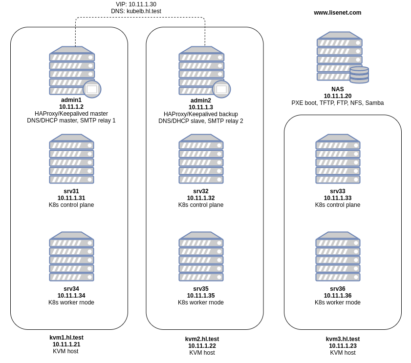

# kubernetes-homelab

A repository to keep resources and configuration files used with my Kubernetes homelab.

# Pre-requisites

A working NFS server is required to create persistent volumes.

* `/mnt/storage-k8s/nfs/prometheus` - the owner:group of the Prometheus NFS folder is set to 65534:65534, because of Prometheus deployment `runAsUser: 65534`.
* `/mnt/storage-k8s/nfs/grafana` - the owner:group of the grafana NFS folder is set to 472:472, because of Grafana deployment `runAsUser: 472`.
* `/mnt/storage-k8s/nfs/alertmanager` - the owner:group of the Alertmanager NFS folder is set to 65534:65534, because of Alertmanager deployment `runAsUser: 65534`.

# Deployment

## Ansible-defined Kubernetes Homelab

See [`ansible/README.md`](./ansible/README.md).

## Kubernetes Resources

Create a monitoring namespace:
```
$ kubectl apply -f ./monitoring-ns-istio-injection-enabled.yml
```

### kube-state-metrics

Deploy `kube-state-metrics`:
```
$ kubectl apply -f ./kube-state-metrics
```

### Prometheus

Deploy `prometheus`:
```
$ kubectl apply -f ./prometheus
```

### Grafana

Deploy `grafana`:
```
$ kubectl apply -f ./grafana
```

### Alertmanager

Alertmanager uses the Incoming Webhooks feature of Slack, therefore you need to set it up if you want to receive Slack alerts.

Update the config map [`alertmanager/alertmanager-config-map.yml`](./alertmanager/alertmanager-config-map.yml) and specify your incoming webhook URL. Deploy `alertmanager`:
```
$ kubectl apply -f ./alertmanager
```

### Mikrotik-exporter

Update the secret file [`mikrotik-exporter/mikrotik-exporter-secret.yml`](./mikrotik-exporter/mikrotik-exporter-secret.yml) and specify your password for the Mikrotik API user. Deploy `mikrotik-exporter`:
```
$ kubectl apply -f ./mikrotik-exporter
```

### X509 Certificate Exporter

Deploy the Helm chart:
```
$ helm upgrade --install x509-certificate-exporter \
  ./charts/x509-certificate-exporter/ \
  --namespace monitoring \
  --debug
```

### MetalLB

Update the config map [`metallb/metallb-config-map.yml`](./metallb/metallb-config-map.yml) and specify the IP address range. Deploy MetalLB network load-balancer:
```
$ kubectl apply -f ./metallb
```

## Install Istio

The Istio namespace must be created manually.

```
$ kubectl create ns istio-system
```

The `kubectl apply` command may show transient errors due to resources not being available in the cluster in the correct order. If that happens, simply run the command again.
```
kubectl apply -f ./istio/istio-kubernetes.yml
```

Install httpd-healthcheck:
```
$ kubectl apply -f ./httpd-healthcheck
```

### Install Istio Addons - Prometheus

```
$ kubectl apply -f istio-addons/prometheus
```

### Install Istio Addons - Kiali

```
$ kubectl apply -f istio-addons/kiali
```

## Create a Homelab ROOT CA
Create your own Certificate Authority (CA) for homelab environment. Run the following a CentOS 7 server:

```
$ vim /etc/pki/tls/certs/make-dummy-cert
$ openssl req -newkey rsa:2048 -keyout homelab-ca.key -nodes -x509 -days 3650 -out homelab-ca.crt
```

## Create a Kubernetes Wildcard Cert Signed by the ROOT CA
```
$ DOMAIN=wildcard.apps.hl.test
$ openssl genrsa -out "${DOMAIN}".key 2048 && chmod 0600 "${DOMAIN}".key
$ openssl req -new -sha256 -key "${DOMAIN}".key -out "${DOMAIN}".csr
$ openssl x509 -req -in "${DOMAIN}".csr -CA homelab-ca.crt -CAkey homelab-ca.key -CAcreateserial -out "${DOMAIN}".crt -days 1825 -sha256
```

# Blog Posts

* [Install and Configure a Multi-Master HA Kubernetes Cluster with kubeadm, HAProxy and Keepalived on CentOS 7](https://www.lisenet.com/2021/install-and-configure-a-multi-master-ha-kubernetes-cluster-with-kubeadm-haproxy-and-keepalived-on-centos-7/)
* [Install Kubernetes Dashboard](https://www.lisenet.com/2021/install-kubernetes-dashboard/)
* [Install Kube State Metrics on Kubernetes](https://www.lisenet.com/2021/install-kube-state-metrics-on-kubernetes/)
* [Install and Configure Prometheus Monitoring on Kubernetes](https://www.lisenet.com/2021/install-and-configure-prometheus-monitoring-on-kubernetes/)
* [Install and Configure Grafana on Kubernetes](https://www.lisenet.com/2021/install-and-configure-grafana-on-kubernetes/)
* [Install and Configure Alertmanager with Slack Integration on Kubernetes](https://www.lisenet.com/2021/install-and-configure-alertmanager-with-slack-integration-on-kubernetes/)
* [Monitor Etcd Cluster with Grafana and Prometheus](https://www.lisenet.com/2021/monitor-etcd-cluster-with-grafana-and-prometheus/)
* [Monitor Bind DNS Server with Grafana and Prometheus (bind_exporter)](https://www.lisenet.com/2021/monitor-bind-dns-server-with-grafana-and-prometheus-bind_exporter/)
* [Monitor HAProxy with Grafana and Prometheus (haproxy_exporter)](https://www.lisenet.com/2021/monitor-haproxy-with-grafana-and-prometheus-haproxy_exporter/)
* [Monitor Linux Servers with Grafana and Prometheus (node_exporter)](https://www.lisenet.com/2021/monitor-linux-servers-with-grafana-and-prometheus-node_exporter/)
* [Monitor Mikrotik Router with Grafana and Prometheus (mikrotik-exporter)](https://www.lisenet.com/2021/monitor-mikrotik-router-with-grafana-and-prometheus-mikrotik-exporter/)
* [Upgrading Homelab Kubernetes Cluster from 1.19 to 1.20](https://www.lisenet.com/2021/upgrading-homelab-kubernetes-cluster-from-1-19-to-1-20/)


# Homelab Network Diagram



# Average Kubernetes Homelab Power Consumption

~80W

Monthly, my homelab costs (((80W * 24h) / 1000) * £0.16/kWh * 365days) / 12months = £9.34 (~13$).
