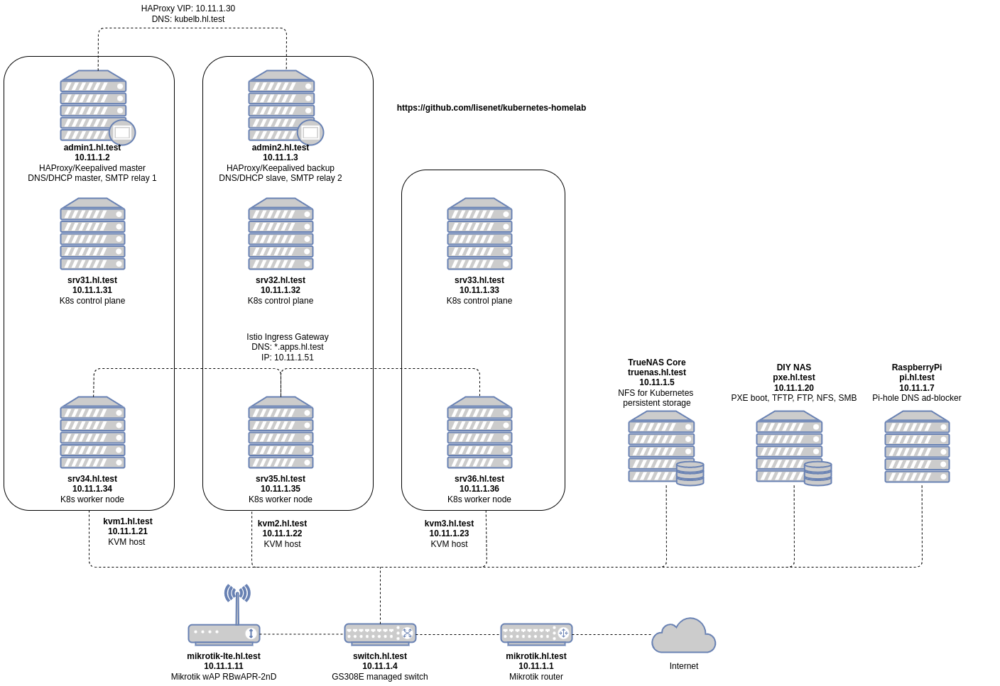
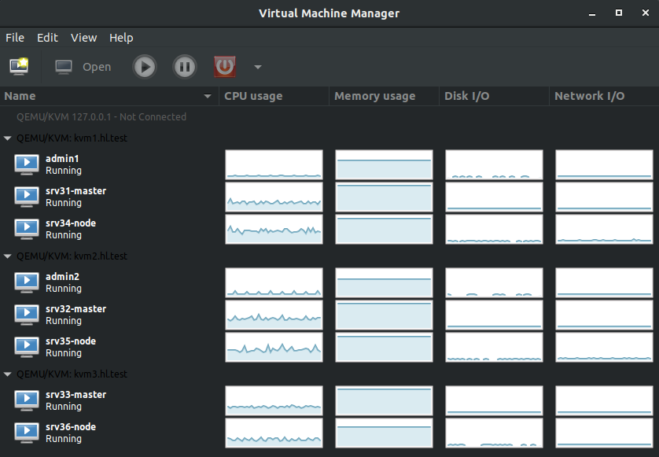
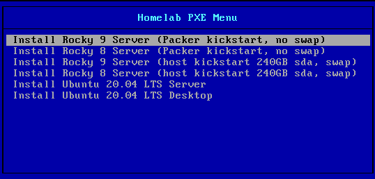
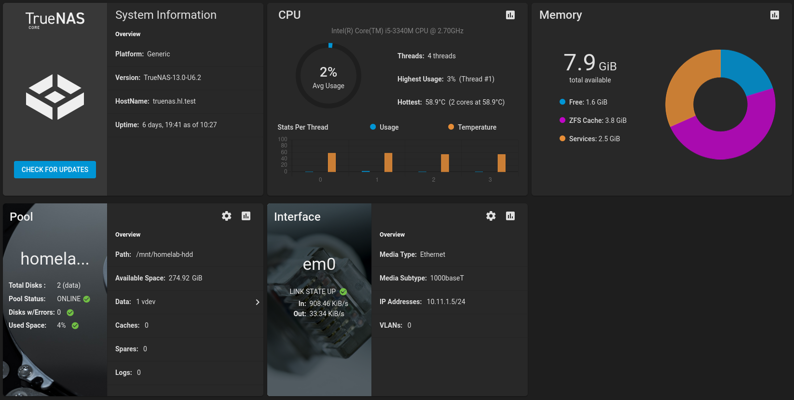

# kubernetes-homelab

A repository to keep resources and configuration files used with my Kubernetes homelab.

[](https://github.com/lisenet/kubernetes-homelab/blob/master/VERSIONS.md)
[](https://github.com/lisenet/kubernetes-homelab/blob/master/VERSIONS.md)
[](https://github.com/lisenet/kubernetes-homelab/blob/master/VERSIONS.md)
[](https://github.com/lisenet/kubernetes-homelab/blob/master/VERSIONS.md)
[](https://github.com/lisenet/kubernetes-homelab/blob/master/LICENSE)
[](https://github.com/lisenet/kubernetes-homelab/commits/master)
[](https://github.com/lisenet/kubernetes-homelab/commits/master)
[](https://github.com/lisenet/kubernetes-homelab/issues)
[](https://github.com/lisenet/kubernetes-homelab/pulls)

# Quick Links

1. [Content of the Repository](#content-of-the-repository)
2. [Homelab Network Diagram](#homelab-network-diagram)
3. [Network Configuration](#network-configuration)
4. [Homelab Infrastructure](#homelab-infrastructure)
    * [Hardware](#hardware)
    * [Guest Provisioning](#guest-provisioning)
    * [Shared Storage](#shared-storage)
    * [Other Services](#other-services)
    * [Kubernetes Cluster Configuration](#kubernetes-cluster-configuration)
    * [Backups](#backups)
    * [Homelab Root CA](#homelab-root-ca)
    * [Average Power Consumption](#average-power-consumption)
5. [Deployment](#deployment)
    * [Ansible-defined Kubernetes Homelab](#ansible-defined-kubernetes-homelab)
    * [Manage Kubernetes Homelab with Terraform](#manage-kubernetes-homelab-with-terraform)
    * [Manage Kubernetes Homelab Manually](#manage-kubernetes-homelab-manually)
    * [Install Istio](#install-istio)
6. [Upgrades](#upgrades)
7. [Blog Posts](#blog-posts)
8. [Stargazers Over Time](#stargazers-over-time)

# Content of the Repository

* [`ansible`](./ansible/README.md) - Ansible playbooks to deploy Kubernetes homelab.
* [`cka`](./cka/) - CKA study notes.
* [`ckad`](./ckad/) - CKAD study notes.
* [`cks`](./cks/) - CKS study notes.
* [`kubernetes`](./kubernetes/README.md) - Kubernetes resources that are defined in YAML and to be deployed using `kubectl`.
* [`kubernetes/helm`](./kubernetes/helm/) - Kubernetes resources to be deployed using `helm` charts.
* [`packer`](./packer/README.md) - configuration files build Qemu/KVM images with Packer.
* [`pxe`](./pxe/) - configuration files for PXE boot and Kickstart.
* `regcred` - docker registry credentials.
* [`terraform`](./terraform/README.md) - configuration files to manage Kubernetes with Terraform.

# Homelab Network Diagram



# Network Configuration

Network is configured as follows:

* LAN: `10.11.1.0/24`.
* Gateway: `10.11.1.1`.
* DNS/DHCP/NTP/SMTP servers: `10.11.1.2` and `10.11.1.3`.
* Managed switch: `10.11.1.4` currently no special config but a couple of VLANs to separate homelab devices from the rest of the home network.
* PXE boot server: `10.11.1.20`.
* DNS private zone: `hl.test` (a reserved top level DNS name .test, see [rfc2606](https://datatracker.ietf.org/doc/html/rfc2606#section-2)).
* DHCP: range `10.11.1.140-10.11.1.149`.

Hostnames and their IP addresses:

| Hostname          | IP Address   | Information                                            | OS |
|:------------------|:-------------|:-------------------------------------------------------|:---|
| mikrotik.hl.test  | 10.11.1.1    | Mikrotik router                                        | RouterOS |
| admin1.hl.test    | 10.11.1.2    | DNS/DHCP master, NTP, SMTP, HAProxy master, Keepalived | Rocky 8 |
| admin2.hl.test    | 10.11.1.3    | DNS/DHCP slave, NTP, SMTP, HAProxy backup, Keepalived  | Rocky 8 |
| switch.hl.test    | 10.11.1.4    | Managed switch                                         | N/A |
| truenas.hl.test   | 10.11.1.5    | TrueNAS Core shared storage server for Kubernetes      | TrueNAS Core 12 |
| pi.hl.test        | 10.11.1.7    | RaspberryPi Pi-hole DNS ad blocker                     | Raspbian |
| mikrotik-lte.hl.test | 10.11.1.11 | Mikrotik wireless access point with LTE antennas      | RouterOS |
| pxe.hl.test       | 10.11.1.20   | PXE boot server                                        | Rocky 8 |
| kvm1.hl.test      | 10.11.1.21   | KVM hypervisor                                         | Rocky 8 |
| kvm2.hl.test      | 10.11.1.22   | KVM hypervisor                                         | Rocky 8 |
| kvm3.hl.test      | 10.11.1.23   | KVM hypervisor                                         | Rocky 8 |
| kubelb.hl.test    | 10.11.1.30   | Virtual IP address for HAProxy/keepalived              | N/A |
| srv31.hl.test     | 10.11.1.31   | Kubernetes control plane                               | Rocky 9 |
| srv32.hl.test     | 10.11.1.32   | Kubernetes control plane                               | Rocky 9 |
| srv33.hl.test     | 10.11.1.33   | Kubernetes control plane                               | Rocky 9 |
| srv34.hl.test     | 10.11.1.34   | Kubernetes worker node                                 | Rocky 9 |
| srv35.hl.test     | 10.11.1.35   | Kubernetes worker node                                 | Rocky 9 |
| srv36.hl.test     | 10.11.1.36   | Kubernetes worker node                                 | Rocky 9 |


# Homelab Infrastructure

Kubernetes environment runs on three KVM hypervisors. The goal is to maintain service in the event of a loss of a (single) host. This [blog post](https://www.lisenet.com/2021/install-and-configure-a-multi-master-ha-kubernetes-cluster-with-kubeadm-haproxy-and-keepalived-on-centos-7/) explains how to build a multi-master Kubernetes homelab cluster by hand using KVM, PXE boot and kubeadm.



## Hardware

Commodity hardware is used to keep costs to a minimum.

| Hostname | CPU Cores | RAM (MB) | Storage | OS |
| --- | --- | --- | --- | --- |
| pxe.hl.test  | 4 | 8192  | 120GB SSD | Rocky 8 |
| kvm1.hl.test | 8 | 22528 | 240GB SSD | Rocky 8 |
| kvm2.hl.test | 8 | 18432 | 240GB SSD | Rocky 8 |
| kvm3.hl.test | 8 | 18432 | 240GB SSD | Rocky 8 |
| truenas.hl.test | 4 | 8192 | 240GB SSD, 2x 320GB HDDs in RAID 1 for storage pool | TrueNAS Core 12 |
| mikrotik.hl.test | 1 | 128 | 128MB | RouterOS |
| pi.hl.test | 1 | 512 | 8GB | Raspbian |

## Guest Provisioning

Previously, provisioning of KVM guests was done by using a [PXE boot server](https://www.lisenet.com/2021/install-and-configure-a-pxe-boot-server-for-kickstart-installation-on-centos/) with Kickstart templates.

I have since migrated to [Packer](./packer/README.md) to make the VM deployment process faster. PXE boot is still used to provision physical hosts (hypervisors).



## Shared Storage

A [TrueNAS](https://www.lisenet.com/2021/moving-to-truenas-and-democratic-csi-for-kubernetes-persistent-storage/) NFS server is used to create persistent volumes claims using `democratic-csi`.



## Other Services

Homelab provides other services to Kubernetes that aren't covered here:
* [Bind DNS servers with failover and dynamic updates](https://www.lisenet.com/2018/configure-bind-dns-servers-with-failover-and-dynamic-updates-on-centos-7/)
* [DHCP failover with dynamic DNS](https://www.lisenet.com/2018/configure-dhcp-failover-with-dynamic-dns-on-centos-7/)
* [Peered NTP servers](https://www.lisenet.com/2018/configure-peered-ntp-servers-on-centos-7/)
* [Redundant SMTP relays](https://www.lisenet.com/2018/configure-postfix-to-relay-mail-to-an-external-smtp-server-on-centos-7/)

## Backups

[Velero](./kubernetes/helm/velero/) is used to safely backup and restore Kubernetes cluster resources and persistent volumes.

## Kubernetes Cluster Configuration

| Component | Software    |
|:------|:----------------|
| CNI   | Calico          |
| CRI   | Containerd      |
| CSI   | Democratic CSI  |
| DNS   | CoreDNS         |
| Load Balancer | MetalLB |
| Service Mesh | Istio    |

## Homelab Root CA

SSL certificates are signed by the homelab CA.

Create your own Certificate Authority (CA) for homelab environment. Run the following on Linux:

```
openssl req -newkey rsa:2048 -keyout homelab-ca.key -nodes -x509 -days 3650 -out homelab-ca.crt
```

### Create a Kubernetes Wildcard Cert Signed by the Root CA

```bash
DOMAIN=wildcard.apps.hl.test
openssl genrsa -out "${DOMAIN}".key 2048 && chmod 0600 "${DOMAIN}".key
openssl req -new -sha256 -key "${DOMAIN}".key -out "${DOMAIN}".csr
openssl x509 -req -in "${DOMAIN}".csr -CA homelab-ca.crt -CAkey homelab-ca.key -CAcreateserial -out "${DOMAIN}".crt -days 1825 -sha256
```

## Average Power Consumption

~170W

Monthly, the homelab costs (((170W * 24h) / 1000) * £0.33/kWh * 365days) / 12months = £40.95 (~47$).

# Deployment

The deployment section assumes that the homelab environment has been provisioned.

## Ansible-defined Kubernetes Homelab

See [`ansible/README.md`](./ansible/README.md).

Use this to deploy Kubernetes cluster with Ansible.

## Manage Kubernetes Homelab with Terraform

See [`terraform/README.md`](./terraform/README.md).

Use this to deploy various Kubernetes resources with Terraform.

## Manage Kubernetes Homelab Manually

### Install democratic-csi Shared Storage Driver

Democratic CSI implements the container storage interface spec providing storage for Kubernetes.

```bash
helm repo add democratic-csi https://democratic-csi.github.io/charts/
helm repo update

helm upgrade --install zfs-nfs \
  democratic-csi/democratic-csi \
  --namespace democratic-csi \
  --create-namespace \
  --version "0.11.1" \
  --values ./kubernetes/helm/truenas-nfs/freenas-nfs.yaml
```

### Install MetalLB

Update the config map [`kubernetes/metallb/metallb-config-map.yml`](./kubernetes/metallb/metallb-config-map.yml) and specify the IP address range. Deploy MetalLB network load-balancer:

```bash
kubectl apply -f ./kubernetes/metallb
```

### Install Istio

The Istio namespace must be created manually.

```bash
kubectl create ns istio-system
```

The `kubectl apply` command may show transient errors due to resources not being available in the cluster in the correct order. If that happens, simply run the command again.

```bash
kubectl apply -f ./kubernetes/istio/istio-kubernetes.yml
```

Install httpd-healthcheck:

```bash
kubectl apply -f ./kubernetes/httpd-healthcheck
```

Install Istio add-on Prometheus:

```bash
kubectl apply -f ./kubernetes/istio-addons/prometheus
```

Install Istio add-on Kiali:

```bash
kubectl apply -f ./kubernetes/istio-addons/kiali
```

### Create Monitoring Namespace

```bash
kubectl apply -f ./kubernetes/monitoring-ns-istio-injection-enabled.yml
kubectl apply -f ./kubernetes/monitoring-ns-with-istio
```

### Install kube-state-metrics

Deploy `kube-state-metrics`:

```bash
kubectl apply -f ./kubernetes/kube-state-metrics
```

### Install Prometheus

Create a secret called **prometheus-cluster-name** that contains the cluster name the Prometheus instance is running in:

```bash
kubectl -n monitoring create secret generic \
  prometheus-cluster-name --from-literal=CLUSTER_NAME=kubernetes-homelab
```

Deploy `prometheus`:

```bash
kubectl apply -f ./kubernetes/prometheus
```

### Install Grafana

```bash
kubectl apply -f ./kubernetes/grafana
```

### Install Alertmanager

Alertmanager uses the Incoming Webhooks feature of Slack, therefore you need to set it up if you want to receive Slack alerts.

Update the config map [`kubernetes/alertmanager/alertmanager-config-map.yml`](./kubernetes/alertmanager/alertmanager-config-map.yml) and specify your incoming webhook URL. Deploy `alertmanager`:

```bash
kubectl apply -f ./kubernetes/alertmanager
```

### Install Mikrotik-exporter

Update the secret file [`kubernetes/mikrotik-exporter/mikrotik-exporter-secret.yml`](./kubernetes/mikrotik-exporter/mikrotik-exporter-secret.yml) and specify your password for the Mikrotik API user. Deploy `mikrotik-exporter`:

```bash
kubectl apply -f ./kubernetes/mikrotik-exporter
```

### Install Pi-hole Exporter

```bash
kubectl apply -f ./kubernetes/pihole-exporter
```

### Install X509 Certificate Exporter

Deploy the Helm chart:

```bash
helm repo add enix https://charts.enix.io

helm install x509-certificate-exporter \
  enix/x509-certificate-exporter \
  --namespace monitoring \
  --version "1.20.0" \
  --values ./kubernetes/helm/x509-certificate-exporter/values.yml
```

### Install Kubecost

```bash
kubectl create namespace kubecost

helm repo add kubecost https://kubecost.github.io/cost-analyzer/

helm upgrade --install kubecost \
  kubecost/cost-analyzer \
  --namespace kubecost \
  --version "1.91.2" \
  --values ./kubernetes/helm/kubecost/values.yaml

kubectl apply -f ./kubernetes/helm/kubecost/kubecost-service.yaml
```

### Install Loki and Promtail

```bash
kubectl create namespace logging
kubectl apply -f ./kubernetes/logging/loki-pvc.yml
kubectl apply -f ./kubernetes/logging/loki-deployment.yml
kubectl apply -f ./kubernetes/logging/promtail-deployment.yml
```

# Upgrades

* [Upgrading Kubernetes from 1.24 to 1.25](https://www.lisenet.com/2023/upgrading-homelab-kubernetes-cluster-from-1-24-to-1-25/)
* [Upgrading Kubernetes from 1.23 to 1.24](https://www.lisenet.com/2022/upgrading-homelab-kubernetes-cluster-from-1-23-to-1-24/)
* [Upgrading Kubernetes from 1.22 to 1.23](https://www.lisenet.com/2022/upgrading-homelab-kubernetes-cluster-from-1-22-to-1-23/)
* [Upgrading Kubernetes from 1.21 to 1.22](https://www.lisenet.com/2021/upgrading-homelab-kubernetes-cluster-from-1-21-to-1-22/)
* [Upgrading Kubernetes from 1.20 to 1.21](https://www.lisenet.com/2021/upgrading-homelab-kubernetes-cluster-from-1-20-to-1-21/)
* [Upgrading Kubernetes from 1.19 to 1.20](https://www.lisenet.com/2021/upgrading-homelab-kubernetes-cluster/)

# Blog Posts

* [Install and Configure a Multi-Master HA Kubernetes Cluster with kubeadm, HAProxy and Keepalived on CentOS 7](https://www.lisenet.com/2021/install-and-configure-a-multi-master-ha-kubernetes-cluster-with-kubeadm-haproxy-and-keepalived-on-centos-7/)
* [Create Your Own Certificate Authority (CA) for Homelab Environment](https://www.lisenet.com/2021/create-your-own-certificate-authority-ca-for-homelab-environment/)
* [Install Kubernetes Dashboard](https://www.lisenet.com/2021/install-kubernetes-dashboard/)
* [Install Kube State Metrics on Kubernetes](https://www.lisenet.com/2021/install-kube-state-metrics-on-kubernetes/)
* [Install and Configure Prometheus Monitoring on Kubernetes](https://www.lisenet.com/2021/install-and-configure-prometheus-monitoring-on-kubernetes/)
* [Install and Configure Grafana on Kubernetes](https://www.lisenet.com/2021/install-and-configure-grafana-on-kubernetes/)
* [Install and Configure Alertmanager with Slack Integration on Kubernetes](https://www.lisenet.com/2021/install-and-configure-alertmanager-with-slack-integration-on-kubernetes/)
* [Monitor Etcd Cluster with Grafana and Prometheus](https://www.lisenet.com/2021/monitor-etcd-cluster-with-grafana-and-prometheus/)
* [Monitor Bind DNS Server with Grafana and Prometheus (bind_exporter)](https://www.lisenet.com/2021/monitor-bind-dns-server-with-grafana-and-prometheus-bind_exporter/)
* [Monitor HAProxy with Grafana and Prometheus (haproxy_exporter)](https://www.lisenet.com/2021/monitor-haproxy-with-grafana-and-prometheus-haproxy_exporter/)
* [Monitor Linux Servers with Grafana and Prometheus (node_exporter)](https://www.lisenet.com/2021/monitor-linux-servers-with-grafana-and-prometheus-node_exporter/)
* [Monitor Mikrotik Router with Grafana and Prometheus (mikrotik-exporter)](https://www.lisenet.com/2021/monitor-mikrotik-router-with-grafana-and-prometheus-mikrotik-exporter/)
* [Install MetalLB and Istio Ingress Gateway with Mutual TLS for Kubernetes](https://www.lisenet.com/2021/install-metallb-and-istio-ingress-gateway-with-mtls-for-kubernetes/)
* [Moving to TrueNAS and Democratic CSI for Kubernetes Persistent Storage](https://www.lisenet.com/2021/moving-to-truenas-and-democratic-csi-for-kubernetes-persistent-storage/)
* [Configure PXE Boot Server for Rocky Linux 8 Kickstart Installation](https://www.lisenet.com/2021/configure-pxe-boot-server-for-rocky-linux-8-kickstart-installation/)
* [Migrating HA Kubernetes Cluster from CentOS 7 to Rocky Linux 8](https://www.lisenet.com/2021/migrating-ha-kubernetes-cluster-from-centos-7-to-rocky-linux-8/)
* [Blue/Green Deployment with Istio: Match Host Header and sourceLabels for Pod to Pod Communication](https://www.lisenet.com/2021/blue-green-deployment-with-istio-match-host-header-and-sourcelabels-for-pod-to-pod-communication/)
* [Install Kubecost to Help Optimise Kubernetes Applications](https://www.lisenet.com/2021/install-kubecost-to-help-optimise-kubernetes-applications/)
* [Speedtest with InfluxDB and Grafana on Kubernetes](https://www.lisenet.com/2021/speedtest-with-influxdb-and-grafana-on-kubernetes/)
* [OpenVPN Server on Kubernetes](https://www.lisenet.com/2022/openvpn-server-on-kubernetes/)
* [Building Qemu KVM Images with Packer](https://www.lisenet.com/2022/building-qemu-kvm-images-with-packer/)
* [Deploy Elasticsearch and Kibana on Kubernetes with Helm](https://www.lisenet.com/2022/deploy-elasticsearch-and-kibana-on-kubernetes-with-helm/)
* [Backup Kubernetes Cluster Resources to AWS S3 with Velero](https://www.lisenet.com/2022/backup-kubernetes-cluster-resources-to-aws-s3-with-velero/)
* [Replacing a Failed Control Plane Node in a HA Kubernetes Cluster](https://www.lisenet.com/2023/replacing-a-failed-control-plane-node-in-a-ha-kubernetes-cluster/)

## Stargazers Over Time

[](https://starchart.cc/lisenet/kubernetes-homelab)

