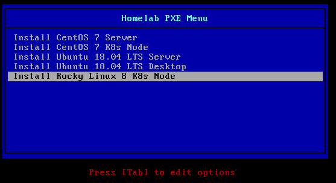
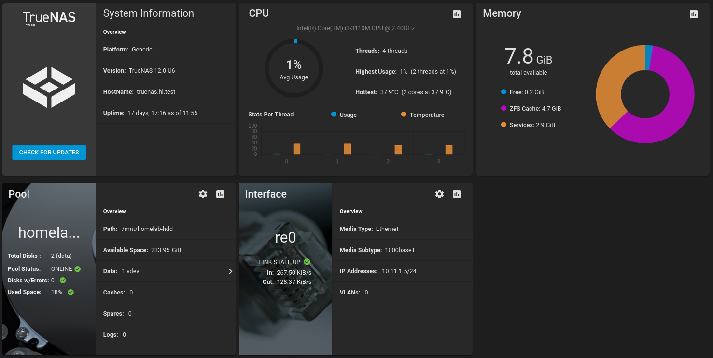

# kubernetes-homelab

A repository to keep resources and configuration files used with my Kubernetes homelab.

[](https://github.com/lisenet/kubernetes-homelab/blob/master/VERSIONS.md)
[](https://github.com/lisenet/kubernetes-homelab/blob/master/LICENSE)
[](https://github.com/lisenet/kubernetes-homelab/commits/master)
[](https://github.com/lisenet/kubernetes-homelab/commits/master)
[](https://github.com/lisenet/kubernetes-homelab/issues)
[](https://github.com/lisenet/kubernetes-homelab/pulls)

# Content of the Repository

* [`alertmanager`](./alertmanager/) - configuration files to deploy Alertmanager.
* [`ansible`](./ansible/README.md) - Ansible playbooks to deploy Kubernetes homelab.
* [`calico`](./calico/) - configuration files to deploy Calico CNI.
* [`charts`](./charts/) - Helm charts.
* [`dashboard`](./dashboard/) - configuration files to deploy Kubernetes dashboard.
* [`docs`](./docs/) - images and documentation files.
* [`grafana`](./grafana/) - configuration files to deploy Grafana.
* [`httpd-healthcheck`](./httpd-healthcheck/) - configuration files deploy a simple httpd healthcheck for Istio ingressgateway.
* [`istio`](./istio/) - configuration files to deploy Istio.
* [`istio-addons`](./istio-addons/) - configuration files to deploy Istio add-ons (e.g. Kiali).
* [`kube-state-metrics`](./kube-state-metrics/) - configuration files to deploy kube-state-metrics.
* [`kubecost`](./kubecost/) - configuration files to deploy Kubecost.
* [`logging`](./logging/) - configuration files to deploy Elastic Stack (Elasticsearch, Kibana etc).
* [`metallb`](./metallb/) - configuration files to deploy MetalLB.
* [`mikrotik-exporter`](./mikrotik-exporter) - configuration files to deploy a Prometheus exporter for Mikrotik devices.
* [`pihole-exporter`](./pihole-exporter/) - configuration files to deploy a Prometheus exporter for Pi-hole Raspberry Pi ad blocker.
* [`pii-demo`](./pii-demo/) - a demo PII application based on Apache, PHP and MySQL to test Istio's mTLS.
* [`pii-demo-blue-green`](./pii-demo-blue-green/) - a demo PII application based that uses blue/green deployment.
* [`prometheus`](./prometheus/) - configuration files to deploy Prometheus monitoring.
* [`pxe`](./pxe/) - configuration files for PXE boot and Kickstart.
* `regcred` - docker registry credentials.
* [`speedtest-influxdb`](./speedtest-influxdb/) - configuration files to deploy a Speedtest service that stores results in InfluxDB.
* [`terraform`](./terraform/) - configuration files to manage Kubernetes with Terraform.
* [`truenas-nfs`](./truenas-nfs/) - configuration files to deploy democratic-csi with TrueNAS NFS.
* [`x509-certificate-exporter`](./x509-certificate-exporter/) - configuration files to deploy x509-certificate-exporter.

# Homelab Network Diagram


# Homelab Infrastructure

Kubernetes environment runs on three KVM hypervisors. The goal is to maintain service in the event of a loss of a (single) host. This [blog post](https://www.lisenet.com/2021/install-and-configure-a-multi-master-ha-kubernetes-cluster-with-kubeadm-haproxy-and-keepalived-on-centos-7/) explains how to build a multi-master Kubernetes homelab cluster by hand using KVM, PXE boot and kubeadm.


## Hardware

Commodity hardware is used to keep costs to a minimum.

| Hostname | CPU Cores | RAM (MB) | Storage |
| --- | --- | --- | --- |
| kvm1.hl.test | 8 | 28672 | 120GB SSD |
| kvm2.hl.test | 8 | 16384 | 120GB SSD |
| kvm3.hl.test | 8 | 16384 | 120GB SSD |
| truenas.hl.test | 4 | 8192 | 240GB SSD, 2x 320GB HDDs in RAID 1 for storage pool |

## Guest Provisioning

Provisioninig of KVM guests is done by using a [PXE boot server](https://www.lisenet.com/2021/install-and-configure-a-pxe-boot-server-for-kickstart-installation-on-centos/) with Kickstart templates.



## Shared Storage

A [TrueNAS](https://www.lisenet.com/2021/moving-to-truenas-and-democratic-csi-for-kubernetes-persistent-storage/) NFS server is used to create persistent volumes claims using `democratic-csi`.



## Other Services

Homelab provides other services to Kubernetes that aren't covered here:
* [Bind DNS servers with failover and dynamic updates](https://www.lisenet.com/2018/configure-bind-dns-servers-with-failover-and-dynamic-updates-on-centos-7/)
* [DHCP failover with dynamic DNS](https://www.lisenet.com/2018/configure-dhcp-failover-with-dynamic-dns-on-centos-7/)
* [Peered NTP servers](https://www.lisenet.com/2018/configure-peered-ntp-servers-on-centos-7/)
* [Redundant SMTP relays](https://www.lisenet.com/2018/configure-postfix-to-relay-mail-to-an-external-smtp-server-on-centos-7/)

## Homelab Root CA

SSL certificates are signed by the homelab CA.

Create your own Certificate Authority (CA) for homelab environment. Run the following a CentOS 7 server:

```
$ vim /etc/pki/tls/certs/make-dummy-cert
$ openssl req -newkey rsa:2048 -keyout homelab-ca.key -nodes -x509 -days 3650 -out homelab-ca.crt
```

### Create a Kubernetes Wildcard Cert Signed by the Root CA

```
$ DOMAIN=wildcard.apps.hl.test
$ openssl genrsa -out "${DOMAIN}".key 2048 && chmod 0600 "${DOMAIN}".key
$ openssl req -new -sha256 -key "${DOMAIN}".key -out "${DOMAIN}".csr
$ openssl x509 -req -in "${DOMAIN}".csr -CA homelab-ca.crt -CAkey homelab-ca.key -CAcreateserial -out "${DOMAIN}".crt -days 1825 -sha256
```

## Average Power Consumption

~80W

Monthly, the homelab costs (((80W * 24h) / 1000) * £0.16/kWh * 365days) / 12months = £9.34 (~13$).

# Deployment

The deployment section assumes that the homelab environment has been provisioned.

## Ansible-defined Kubernetes Homelab

See [`ansible/README.md`](./ansible/README.md).

Use this to deploy Kubernetes cluster with Ansible.

## Manage Kubernetes Homelab with Terraform

See [`terraform/README.md`](./terraform/README.md).

Use this to deploy various Kubernetes resources with Terraform.

## Manage Kubernetes Homelab Manually

Create a monitoring namespace:
```
$ kubectl apply -f ./monitoring-ns-istio-injection-enabled.yml
```

### kube-state-metrics

Deploy `kube-state-metrics`:
```
$ kubectl apply -f ./kube-state-metrics
```

### Prometheus

Create a secret called **prometheus-cluster-name** that contains the cluster name the Prometheus instance is running in:

```
$ kubectl -n monitoring create secret generic \
  prometheus-cluster-name --from-literal=CLUSTER_NAME=kubernetes-homelab
```

Deploy `prometheus`:
```
$ kubectl apply -f ./prometheus
```

### Grafana

Deploy `grafana`:
```
$ kubectl apply -f ./grafana
```

### Alertmanager

Alertmanager uses the Incoming Webhooks feature of Slack, therefore you need to set it up if you want to receive Slack alerts.

Update the config map [`alertmanager/alertmanager-config-map.yml`](./alertmanager/alertmanager-config-map.yml) and specify your incoming webhook URL. Deploy `alertmanager`:
```
$ kubectl apply -f ./alertmanager
```

### Mikrotik-exporter

Update the secret file [`mikrotik-exporter/mikrotik-exporter-secret.yml`](./mikrotik-exporter/mikrotik-exporter-secret.yml) and specify your password for the Mikrotik API user. Deploy `mikrotik-exporter`:
```
$ kubectl apply -f ./mikrotik-exporter
```

### X509 Certificate Exporter

Deploy the Helm chart:
```
$ helm install x509-certificate-exporter \
  enix/x509-certificate-exporter \
  --namespace monitoring \
  --values ./x509-certificate-exporter/values.yml
```

### MetalLB

Update the config map [`metallb/metallb-config-map.yml`](./metallb/metallb-config-map.yml) and specify the IP address range. Deploy MetalLB network load-balancer:
```
$ kubectl apply -f ./metallb
```

## Install Istio

The Istio namespace must be created manually.

```
$ kubectl create ns istio-system
```

The `kubectl apply` command may show transient errors due to resources not being available in the cluster in the correct order. If that happens, simply run the command again.
```
kubectl apply -f ./istio/istio-kubernetes.yml
```

Install httpd-healthcheck:
```
$ kubectl apply -f ./httpd-healthcheck
```

### Install Istio Addons - Prometheus

```
$ kubectl apply -f istio-addons/prometheus
```

### Install Istio Addons - Kiali

```
$ kubectl apply -f istio-addons/kiali
```

# Upgrades

* [Upgrading Kubernetes from 1.19 to 1.20](https://www.lisenet.com/2021/upgrading-homelab-kubernetes-cluster/)
* [Upgrading Kubernetes from 1.20 to 1.21](https://www.lisenet.com/2021/upgrading-homelab-kubernetes-cluster-from-1-20-to-1-21/)
* [Upgrading Kubernetes from 1.21 to 1.22](https://www.lisenet.com/2021/upgrading-homelab-kubernetes-cluster-from-1-21-to-1-22/)

# Blog Posts

* [Install and Configure a Multi-Master HA Kubernetes Cluster with kubeadm, HAProxy and Keepalived on CentOS 7](https://www.lisenet.com/2021/install-and-configure-a-multi-master-ha-kubernetes-cluster-with-kubeadm-haproxy-and-keepalived-on-centos-7/)
* [Create Your Own Certificate Authority (CA) for Homelab Environment](https://www.lisenet.com/2021/create-your-own-certificate-authority-ca-for-homelab-environment/)
* [Install Kubernetes Dashboard](https://www.lisenet.com/2021/install-kubernetes-dashboard/)
* [Install Kube State Metrics on Kubernetes](https://www.lisenet.com/2021/install-kube-state-metrics-on-kubernetes/)
* [Install and Configure Prometheus Monitoring on Kubernetes](https://www.lisenet.com/2021/install-and-configure-prometheus-monitoring-on-kubernetes/)
* [Install and Configure Grafana on Kubernetes](https://www.lisenet.com/2021/install-and-configure-grafana-on-kubernetes/)
* [Install and Configure Alertmanager with Slack Integration on Kubernetes](https://www.lisenet.com/2021/install-and-configure-alertmanager-with-slack-integration-on-kubernetes/)
* [Monitor Etcd Cluster with Grafana and Prometheus](https://www.lisenet.com/2021/monitor-etcd-cluster-with-grafana-and-prometheus/)
* [Monitor Bind DNS Server with Grafana and Prometheus (bind_exporter)](https://www.lisenet.com/2021/monitor-bind-dns-server-with-grafana-and-prometheus-bind_exporter/)
* [Monitor HAProxy with Grafana and Prometheus (haproxy_exporter)](https://www.lisenet.com/2021/monitor-haproxy-with-grafana-and-prometheus-haproxy_exporter/)
* [Monitor Linux Servers with Grafana and Prometheus (node_exporter)](https://www.lisenet.com/2021/monitor-linux-servers-with-grafana-and-prometheus-node_exporter/)
* [Monitor Mikrotik Router with Grafana and Prometheus (mikrotik-exporter)](https://www.lisenet.com/2021/monitor-mikrotik-router-with-grafana-and-prometheus-mikrotik-exporter/)
* [Install MetalLB and Istio Ingress Gateway with Mutual TLS for Kubernetes](https://www.lisenet.com/2021/install-metallb-and-istio-ingress-gateway-with-mtls-for-kubernetes/)
* [Moving to TrueNAS and Democratic CSI for Kubernetes Persistent Storage](https://www.lisenet.com/2021/moving-to-truenas-and-democratic-csi-for-kubernetes-persistent-storage/)
* [Configure PXE Boot Server for Rocky Linux 8 Kickstart Installation](https://www.lisenet.com/2021/configure-pxe-boot-server-for-rocky-linux-8-kickstart-installation/)
* [Migrating HA Kubernetes Cluster from CentOS 7 to Rocky Linux 8](https://www.lisenet.com/2021/migrating-ha-kubernetes-cluster-from-centos-7-to-rocky-linux-8/)
* [Blue/Green Deployment with Istio: Match Host Header and sourceLabels for Pod to Pod Communication](https://www.lisenet.com/2021/blue-green-deployment-with-istio-match-host-header-and-sourcelabels-for-pod-to-pod-communication/)
* [Install Kubecost to Help Optimise Kubernetes Applications](https://www.lisenet.com/2021/install-kubecost-to-help-optimise-kubernetes-applications/)
* [Speedtest with InfluxDB and Grafana on Kubernetes](https://www.lisenet.com/2021/speedtest-with-influxdb-and-grafana-on-kubernetes/)

## Stargazers over time

[](https://starchart.cc/lisenet/kubernetes-homelab)

