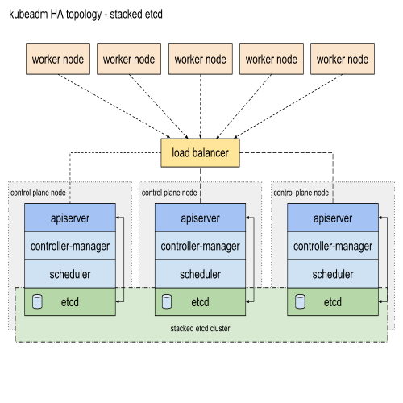

# Certified Kubernetes Administrator (CKA)

Preparation and study material for Certified Kubernetes Administrator exam v1.22.

- [Reasoning](#reasoning)
- [Aliases](#aliases)
- [Allowed Kubernetes documentation resources](#allowed-kubernetes-documentation-resources)
- [CKA Exam Simulator](#cka-exam-simulator)
- [Cluster Architecture, Installation and Configuration](#cluster-architecture-installation-and-configuration)
    - [Provision underlying infrastructure to deploy a Kubernetes cluster](#provision-underlying-infrastructure-to-deploy-a-kubernetes-cluster)
    - [Use Kubeadm to install a basic cluster](#use-kubeadm-to-install-a-basic-cluster)
    - [Implement etcd backup and restore](#implement-etcd-backup-and-restore)
    - [Perform a version upgrade on a Kubernetes cluster using Kubeadm](#perform-a-version-upgrade-on-a-kubernetes-cluster-using-kubeadm)
    - [Manage role based access control (RBAC)](#manage-role-based-access-control-rbac)
    - [Manage a highly-available Kubernetes cluster](#manage-a-highly-available-kubernetes-cluster)
- [Workloads and Scheduling](#workloads-and-scheduling)
    - [Understand deployments and how to perform rolling update and rollbacks](#understand-deployments-and-how-to-perform-rolling-update-and-rollbacks)
    - [Use ConfigMaps and Secrets to configure applications](#use-configmaps-and-secrets-to-configure-applications)
    - [Know how to scale applications](#know-how-to-scale-applications)
    - [Understand the primitives used to create robust, self-healing, application deployments](#understand-the-primitives-used-to-create-robust-self-healing-application-deployments)
    - [Understand how resource limits can affect Pod scheduling](#understand-how-resource-limits-can-affect-pod-scheduling)
    - [Awareness of manifest management and common templating tools](#awareness-of-manifest-management-and-common-templating-tools)
- [Services and Networking](#services-and-networking)
    - [Understand host networking configuration on the cluster nodes](#understand-host-networking-configuration-on-the-cluster-nodes)
    - [Understand connectivity between Pods](#understand-connectivity-between-pods)
    - [Understand ClusterIP, NodePort, LoadBalancer service types and endpoints](#understand-clusterip-nodeport-loadbalancer-service-types-and-endpoints)
    - [Know how to use Ingress controllers and Ingress resources](#know-how-to-use-ingress-controllers-and-ingress-resources)
    - [Know how to configure and use CoreDNS](#know-how-to-configure-and-use-coredns)
    - [Choose an appropriate container network interface plugin](#choose-an-appropriate-container-network-interface-plugin)
- [Storage](#storage)
    - [Understand storage classes, persistent volumes](#understand-storage-classes-persistent-volumes)
    - [Understand volume mode, access modes and reclaim policies for volumes](#Understand-volume-mode-access-modes-and-reclaim-policies-for-volumes)
    - [Understand persistent volume claims primitive](#understand-persistent-volume-claims-primitive)
    - [Know how to configure applications with persistent storage](#know-how-to-configure-applications-with-persistent-storage)
- [Troubleshooting](#troubleshooting)
    - [Evaluate cluster and node logging](#evaluate-cluster-and-node-logging)
    - [Understand how to monitor applications](#understand-how-to-monitor-applications)
    - [Manage container stdout and stderr logs](#manage-container-stdout-and-stderr-logs)
    - [Troubleshoot application failure](#troubleshoot-application-failure)
    - [Troubleshoot cluster component failure](#troubleshoot-cluster-component-failure)
    - [Troubleshoot networking](#troubleshoot-networking)

## Reasoning

After using Kubernetes in production for over a year now (both on-prem and AWS/EKS), I wanted to see what the CKA exam is all about.

## Aliases

Keep it simple:

```
alias k=kubectl
alias do="--dry-run=client -o yaml"
alias now="--force --grace-period 0"
```

## Allowed Kubernetes documentation resources

* [kubectl Cheat Sheet](https://kubernetes.io/docs/reference/kubectl/cheatsheet/)
* [Kubernetes Documentation](https://kubernetes.io/docs)
* [GitHub Kubernetes](https://github.com/kubernetes/kubernetes)
* [Kubernetes Blog](https://kubernetes.io/blog)

## CKA Exam Simulator

https://killer.sh/cka

Do not sit the CKA exam unless you get the perfect score **and** understand the solutions (regardless of the time taken to solve all questions).


## Cluster Architecture, Installation and Configuration

Unless stated otherwise, all Kubernetes resources should be created in the `cka` namespace.

### Provision underlying infrastructure to deploy a Kubernetes cluster

We have a six-node (three control planes and three worker nodes) Kubernetes homelab cluster running Rocky Linux already.

For the sake of this excercise, we will create a new two-node cluster, with one control plane and one worker node, using Ubuntu 18.04 LTS. It makes sense to use a Debian-based distribution here because we have a RHEL-based homelab cluster already.

Libvirt/KVM nodes:

* srv39-master: 2 vCPUs, 4GB RAM, 16GB disk, 10.11.1.39/24
* srv40-node: 2 vCPUs, 4GB RAM, 16GB disk, 10.11.1.40/24

Provision a KVM guest for the **control plane**:

```
virt-install \
  --connect qemu+ssh://root@kvm1.hl.test/system \
  --name srv39-master \
  --network bridge=br0,model=virtio,mac=C0:FF:EE:D0:5E:39 \
  --disk path=/mnt/storage-luks/libvirt/srv39.qcow2,size=16 \
  --pxe \
  --ram 4096 \
  --vcpus 2 \
  --os-type linux \
  --os-variant ubuntu18.04 \
  --sound none \
  --rng /dev/urandom \
  --virt-type kvm \
  --wait 0
```

Provision a KVM guest for the **worker node**:

```
virt-install \
  --connect qemu+ssh://root@kvm1.hl.test/system \
  --name srv40-node \
  --network bridge=br0,model=virtio,mac=C0:FF:EE:D0:5E:40 \
  --disk path=/mnt/storage-luks/libvirt/srv40.qcow2,size=16 \
  --pxe \
  --ram 4096 \
  --vcpus 2 \
  --os-type linux \
  --os-variant ubuntu18.04 \
  --sound none \
  --rng /dev/urandom \
  --virt-type kvm \
  --wait 0
```

### Use Kubeadm to install a basic cluster

We will use `kubeadm` to install a Kubernetes v1.22 cluster.

Docs: https://kubernetes.io/docs/setup/production-environment/container-runtimes/

Install container runtime on all nodes:

```
cat <<EOF | sudo tee /etc/modules-load.d/containerd.conf
overlay
br_netfilter
EOF

sudo modprobe overlay
sudo modprobe br_netfilter

cat <<EOF | sudo tee /etc/sysctl.d/99-kubernetes-cri.conf
net.bridge.bridge-nf-call-iptables  = 1
net.ipv4.ip_forward                 = 1
net.bridge.bridge-nf-call-ip6tables = 1
EOF

sudo sysctl --system
```

Install `containerd` on all nodes:

```
sudo apt-get update
sudo apt-get -y install apt-transport-https ca-certificates curl gnupg lsb-release

curl -fsSL https://download.docker.com/linux/ubuntu/gpg | sudo gpg --dearmor -o /usr/share/keyrings/docker-archive-keyring.gpg

echo \
  "deb [arch=$(dpkg --print-architecture) signed-by=/usr/share/keyrings/docker-archive-keyring.gpg] https://download.docker.com/linux/ubuntu \
  $(lsb_release -cs) stable" | sudo tee /etc/apt/sources.list.d/docker.list > /dev/null

sudo apt-get update
sudo apt-get -y install containerd.io

sudo mkdir -p /etc/containerd
containerd config default | sudo tee /etc/containerd/config.toml
sudo systemctl restart containerd
```

To use the `systemd` cgroup driver in `/etc/containerd/config.toml` with `runc`, set:

```
[plugins."io.containerd.grpc.v1.cri".containerd.runtimes.runc]
  ...
  [plugins."io.containerd.grpc.v1.cri".containerd.runtimes.runc.options]
    SystemdCgroup = true
```

Make sure to restart containerd:

```
sudo systemctl restart containerd
```

Docs: https://kubernetes.io/docs/setup/production-environment/tools/kubeadm/create-cluster-kubeadm/

Install `kubeadm`, `kubelet` and `kubectl` (v1.22):

```
sudo curl -fsSLo /usr/share/keyrings/kubernetes-archive-keyring.gpg https://packages.cloud.google.com/apt/doc/apt-key.gpg

echo "deb [signed-by=/usr/share/keyrings/kubernetes-archive-keyring.gpg] https://apt.kubernetes.io/ kubernetes-xenial main" | sudo tee /etc/apt/sources.list.d/kubernetes.list

sudo apt-get update
sudo apt-get install -y kubelet=1.22.6-00 kubeadm=1.22.6-00 kubectl=1.22.6-00
sudo apt-mark hold kubelet kubeadm kubectl
sudo systemctl enable kubelet
```

Docs: https://kubernetes.io/fr/docs/setup/production-environment/tools/kubeadm/create-cluster-kubeadm/#pod-network

Initialise the **control plane** node. Set pod network CIDR based on the CNI that you plan to install later:

* Calico - `192.168.0.0/16`
* Flannel - `10.244.0.0/16`
* Weave Net - `10.32.0.0/12`

We are going to use Flannel, hence `10.244.0.0/16`.

```
sudo kubeadm init \
  --kubernetes-version "1.22.6" \
  --pod-network-cidr "10.244.0.0/16"
```

Configure `kubectl` access on the **control plane**:

```
mkdir -p $HOME/.kube
sudo cp -i /etc/kubernetes/admin.conf $HOME/.kube/config
sudo chown $(id -u):$(id -g) $HOME/.kube/config
```

Run the output of the init command on the **worker node**:

```
kubeadm join 10.11.1.39:6443 --token "ktlb43.llip8nym905afakm" \
	--discovery-token-ca-cert-hash sha256:b3f1c31e2777bd54b3f7a797659a96072711809ae84e8c9be3fba449c8e32dd4
```

Install a pod network to the cluster. You can choose one of the following: Calico, Flannel, Weave Net.

* To install Calico, run the following:

```
kubectl apply -f "https://projectcalico.docs.tigera.io/manifests/calico.yaml"
```

* To install Flannel (for Kubernetes v1.17+), run the following:

```
kubectl apply -f "https://raw.githubusercontent.com/flannel-io/flannel/master/Documentation/kube-flannel.yml"
```

* To install Weave Net, run the following:

```
kubectl apply -f "https://cloud.weave.works/k8s/net?k8s-version=$(kubectl version | base64 | tr -d '\n')"
```

Check the cluster to make sure that all nodes are running and ready:

```
kubectl get nodes
NAME    STATUS   ROLES                  AGE    VERSION
srv39   Ready    control-plane,master   14m    v1.22.6
srv40   Ready    <none>                 102s   v1.22.6
```

### How to add new worker nodes to the cluster?

Docs: https://kubernetes.io/docs/reference/setup-tools/kubeadm/kubeadm-join/

Create a new token on the control plane:

```
kubeadm token create --print-join-command
```

The output will be something like this:

```
kubeadm join 10.11.1.39:6443 --token hh{truncated}g4 --discovery-token-ca-cert-hash sha256:77{truncated}28
```

Run the `kubeadm join` command on a new worker node that is to be added to the cluster.

### Implement etcd backup and restore

Docs: https://kubernetes.io/docs/tasks/administer-cluster/configure-upgrade-etcd/#backing-up-an-etcd-cluster

Install etcd client package on the **control plane** using a package manager (this may not always install the version of the package that you want):

```
sudo apt-get -y install etcd-client
```

Alternaitvelly:

```
ETCD_VER=v3.5.2
GITHUB_URL=https://github.com/etcd-io/etcd/releases/download
DOWNLOAD_URL=${GITHUB_URL}

mkdir -p /tmp/etcd-download-test
curl -fsSL ${DOWNLOAD_URL}/${ETCD_VER}/etcd-${ETCD_VER}-linux-amd64.tar.gz -o /tmp/etcd-${ETCD_VER}-linux-amd64.tar.gz
tar xzvf /tmp/etcd-${ETCD_VER}-linux-amd64.tar.gz -C /tmp/etcd-download-test --strip-components=1
rm -f /tmp/etcd-${ETCD_VER}-linux-amd64.tar.gz

/tmp/etcd-download-test/etcdctl version
etcdctl version: 3.5.2
API version: 3.5
```

Find paths of certificates and keys:

```
egrep "cert-|key-|trusted-" /etc/kubernetes/manifests/etcd.yaml|grep -ve peer
    - --cert-file=/etc/kubernetes/pki/etcd/server.crt
    - --client-cert-auth=true
    - --key-file=/etc/kubernetes/pki/etcd/server.key
    - --trusted-ca-file=/etc/kubernetes/pki/etcd/ca.crt
```

Take a snapshot by specifying the endpoint and certificates:

```
ETCDCTL_API=3 etcdctl \
  --endpoints=https://127.0.0.1:2379 \
  --cacert=/etc/kubernetes/pki/etcd/ca.crt \
  --cert=/etc/kubernetes/pki/etcd/server.crt \
  --key=/etc/kubernetes/pki/etcd/server.key \
  snapshot save "/root/etcd_backup_$(date +%F).db"
```

Do not use `snapshot status` command because it can alter the snapshot file and render it invalid.

Restore an etcd cluster from the snapshot. Identify the default `data-dir`:

```
grep data-dir /etc/kubernetes/manifests/etcd.yaml
    - --data-dir=/var/lib/etcd
```

If any API servers are running in your cluster, you should not attempt to restore instances of etcd. Instead, follow these steps to restore etcd:

* Stop all API server instances.
* Restore state in all etcd instances.
* Restart all API server instances.

Stop all controlplane components:

```
cd /etc/kubernetes/manifests/
mv ./*yaml ../
```

Restore the snapshot into a specific directory:

```
ETCDCTL_API=3 etcdctl \
  --endpoints=https://127.0.0.1:2379 \
  --cacert=/etc/kubernetes/pki/etcd/ca.crt \
  --cert=/etc/kubernetes/pki/etcd/server.crt \
  --key=/etc/kubernetes/pki/etcd/server.key \
  --data-dir /var/lib/etcd_backup \
  snapshot restore "/root/etcd_backup_$(date +%F).db"
```

Tell etcd to use the new directory `/var/lib/etcd_backup`:

```
sed -i 's/\/var\/lib\/etcd/\/var\/lib\/etcd_backup/g' /etc/kubernetes/manifests/etcd.yaml
```

Start all controlplane components:

```
cd /etc/kubernetes/manifests/
mv ../*yaml ./
```

Give it some time (up to several minutes) for etcd to restart.

### Perform a version upgrade on a Kubernetes cluster using Kubeadm

Docs: https://kubernetes.io/docs/tasks/administer-cluster/kubeadm/kubeadm-upgrade/

We will upgrade previously deployed Kubernetes cluster v1.22 to v1.23.

Find the latest version in the list:

```
apt-get update
apt-cache madison kubeadm
```

Upgrade the **control plane**:

```
apt-mark unhold kubeadm && \
apt-get update && apt-get install -y kubeadm=1.23.3-00 && \
apt-mark hold kubeadm

kubeadm version
sudo kubeadm upgrade plan
sudo kubeadm upgrade apply v1.23.3

kubectl drain srv39 --ignore-daemonsets

apt-mark unhold kubelet kubectl && \
apt-get install -y kubelet=1.23.3-00 kubectl=1.23.3-00 && \
apt-mark hold kubelet kubectl

sudo systemctl daemon-reload
sudo systemctl restart kubelet
kubectl uncordon srv39
```

Upgrade the **worker node**:

```
apt-mark unhold kubeadm && \
apt-get update && apt-get install -y kubeadm=1.23.3-00 && \
apt-mark hold kubeadm

sudo kubeadm upgrade node

kubectl drain srv40 --ignore-daemonsets

apt-mark unhold kubelet kubectl && \
apt-get install -y kubelet=1.23.3-00 kubectl=1.23.3-00 && \
apt-mark hold kubelet kubectl

sudo systemctl daemon-reload
sudo systemctl restart kubelet
kubectl uncordon srv40
```

Verify the status of the cluster:

```
kubectl get nodes
NAME    STATUS   ROLES                  AGE   VERSION
srv39   Ready    control-plane,master   38m   v1.23.3
srv40   Ready    <none>                 33m   v1.23.3
```

### Manage role based access control (RBAC)

Docs: 
* https://kubernetes.io/docs/reference/access-authn-authz/rbac/
* https://kubernetes.io/docs/reference/access-authn-authz/certificate-signing-requests/

**Exercise 1**: perform the following tasks.

1. Create a new user called `peasant` and grant the user access to the Kubernetes cluster.
2. Generate a private key `peasant.key` and CSR `peasant.csr` for the user.
3. User should have permissions to `get` and `list` the following resources in the `cka` namespace: `pods` and `services`.
4. Check API access using the `auth can-i` subcommand.

A few steps are required in order to get a normal user to be able to authenticate and invoke an API. First, this user must have a certificate issued by the Kubernetes cluster, and then present that certificate to the Kubernetes API.

Create a private key and a CSR using `openssl`:

```
openssl genrsa -out peasant.key 2048
openssl req -new -key peasant.key -out peasant.csr
```

Create a `CertificateSigningRequest` and submit it to a Kubernetes cluster:

```
cat peasant.csr | base64 | tr -d "\n"

cat > peasant-csr.yaml <<EOF
apiVersion: certificates.k8s.io/v1
kind: CertificateSigningRequest
metadata:
  name: peasant
spec:
  request: LS0tLS1CRUdJTiBDRVJUSUZJQ0FURSBSRVFVRVNULS0tLS0KTUlJQ2lEQ0NBWEFDQVFBd1F6RUxNQWtHQTFVRUJoTUNSMEl4RURBT0JnTlZCQWdNQjBodmJXVnNZV0l4RURBTwpCZ05WQkFvTUIwaHZiV1ZzWVdJeEVEQU9CZ05WQkFNTUIzQmxZWE5oYm5Rd2dnRWlNQTBHQ1NxR1NJYjNEUUVCCkFRVUFBNElCRHdBd2dnRUtBb0lCQVFEYm4xd3c5bExDbERDd1EyeTlsVE1sSG9SUHNJS0VmbnFvb25mUmZiMnQKdzE5dzhrK3BGbkJsQkVxNEtSTldHSThnRkpab2MvS0lJN25lUnQwVDNnSkcrV09hWW56M2lYK3liL3IyNmh6ZwpTUWVWVjJCVEYxTVp3T0FmcjJpa2dPN1l4Z1YrZ0gwNFRmU1hKRUdSa2hUWEs4bWZzT3NrMHpnWW1NRHgvSkxpCmVZSWdlSkZMVnhoeCtUU3B2NzZQREk4OEJrVXpQbzYrQ2hXaExPcHRsL041Ym5BWXpXY2hIa2VTbGEwcC9UNnAKZ2RtR0tPOXkyN3k5bUx0MnJkd1Q2Tld5cXBsQk9ZbzloZ0VzKy9BYm5CSllvc0VMUzBKZmxpai90S3hEUyt0Qwp5YUY5NmQ0eTd3MUE3eVk4bmxZV3VIOFRUbXg4N0VySHA2OE16eUlZcmVYSkFnTUJBQUdnQURBTkJna3Foa2lHCjl3MEJBUXNGQUFPQ0FRRUFOMVIzY2Z4bTErZ0NiS1hxK0oyUkJ4eUFrSnFxNzF0SlZBemJmT3dScDV6REk4WTAKUHhCYlpBTjVGZVh3UFRyZnlPNm50TDFWSy9vTW9ETXoxTXNPZDZ5OXp6RGZYaHZRb3EvWW1Yd1g3M05iVzhJNQpweG1PRWkyeTZydEd2eVA2SHpicmtGTnNiVklPRktWMWhPSU9neitvd25TOFpUNWZzQmZOdXQ3eTRJTEZydmNRCnl6Mk0rWlAyWm96VlZ0NE9GaXNSSUF1MGlocE5Uc0ZLNkZUM3ZjblQ4bnZHQm5rS0NEeEh2YmRWVVdDK2xIZmkKZDI2Q3FwVmxQemNQRnRqRCtYQyswU2UzamJ1eW40MkxJYzRkaVBHUDA0a2Nsa2NLLzF1Z2NITHNCSjZZUGdyeQpSc05iQkhCSHM3c1hvNUw4NHIyOGlTL0RWR281d2tSd2hHNzlwUT09Ci0tLS0tRU5EIENFUlRJRklDQVRFIFJFUVVFU1QtLS0tLQo=
  signerName: kubernetes.io/kube-apiserver-client
  usages:
  - client auth
EOF

kubectl apply -f peasant-csr.yaml
```

Approve certificate signing request:

```
kubectl get csr
NAME      AGE   SIGNERNAME                            REQUESTOR          REQUESTEDDURATION   CONDITION
peasant   10s   kubernetes.io/kube-apiserver-client   kubernetes-admin   <none>              Pending

kubectl certificate approve peasant
```

Create a role and rolebinding:

```
kubectl create role peasant-role --resource=pods,svc --verb=get,list -n cka
kubectl create rolebinding peasant-role-binding --role=peasant-role --user=peasant -n cka
```

Verify:

```
kubectl auth can-i get pods --as=peasant -n cka
yes

kubectl auth can-i delete pods --as=peasant -n cka
no

kubectl auth can-i list svc --as=peasant -n cka
yes

kubectl auth can-i update svc --as=peasant -n cka
no
```

**Exercise 2**: perform the following tasks.

1. Create a new service account `kubernetes-dashboard-sa`.
2. Create a cluster role `kubernetes-dashboard-clusterrole` that grants permissions `get,list,watch` to resources `pods,nodes` to API group `metrics.k8s.io`.
3. Grant the service account access to the cluster by creating a cluster role binding `kubernetes-dashboard-role-binding`.


Create a service account:

```
kubectl create sa kubernetes-dashboard-sa -n cka
```

Create a cluser role:

```
kubectl create clusterrole kubernetes-dashboard-clusterrole \
  --verb=get,list,watch --resource=pods,nodes 
  --dry-run=client -o yaml | sed 's/- ""/- metrics.k8s.io/g' | kubectl apply -f -
```

Create a cluster role binding:

```
kubectl create clusterrolebinding kubernetes-dashboard-role-binding \
  --clusterrole=kubernetes-dashboard-clusterrole \
  --serviceaccount=cka:kubernetes-dashboard-sa
```

### Manage a highly-available Kubernetes cluster

Docs: https://kubernetes.io/docs/setup/production-environment/tools/kubeadm/high-availability/

A stacked HA cluster is a topology where the distributed data storage cluster provided by etcd is stacked on top of the cluster formed by the nodes managed by kubeadm that run control plane components. This is the default topology in kubeadm.



Create a kube-apiserver load balancer with a name that resolves to DNS. Install HAProxy and allow it to listen on kube-apiserver port 6443, configure firewall to allow inbound HAProxy traffic on kube-apiserver port 6443.

```
sudo apt-get -y install haproxy psmisc
```

Configure HAProxy <code>/etc/haproxy/haproxy.cfg</code>:

```
global
  log /dev/log  local0
  log /dev/log  local1 notice
  stats socket /var/lib/haproxy/stats level admin
  chroot /var/lib/haproxy
  user haproxy
  group haproxy
  daemon

defaults
  log global
  mode  http
  option  httplog
  option  dontlognull
        timeout connect 5000
        timeout client 50000
        timeout server 50000

frontend kubernetes
    bind 10.11.1.30:6443
    option tcplog
    mode tcp
    default_backend kubernetes-master-nodes

backend kubernetes-master-nodes
    mode tcp
    balance roundrobin
    option tcp-check
    server srv31-master 10.11.1.31:6443 check fall 3 rise 2
    server srv32-master 10.11.1.32:6443 check fall 3 rise 2
    server srv33-master 10.11.1.33:6443 check fall 3 rise 2
```

Configure DNS:

```
host kubelb.hl.test
kubelb.hl.test has address 10.11.1.30
```

Enable and start HAProxy service:
```
sudo systemctl enable --now haproxy
```

Initialise the control plane:
```
sudo kubeadm init \
  --control-plane-endpoint "kubelb.hl.test:6443" \
  --upload-certs
```

Join other control plane nodes to the cluster.

## Workloads and Scheduling

Unless stated otherwise, all Kubernetes resources should be created in the `cka` namespace.

### Understand deployments and how to perform rolling update and rollbacks

Docs: https://kubernetes.io/docs/concepts/workloads/controllers/deployment/#rolling-back-a-deployment

**Exercise 1**: perform the following tasks.

1. Create a deployment object `httpd-pii-demo` consisting of 4 pods, each containing a single `lisenet/httpd-pii-demo:0.2` container. It should be able to run on master nodes as well.
2. Identify the update strategy employed by this deployment.
3. Modify the update strategy so `maxSurge` is equal to `50%` and `maxUnavailable` is equal to `50%`.
4. Perform a rolling update to this deployment so that the image gets updated to `lisenet/httpd-pii-demo:0.3`.
5. Undo the most recent change.

Imperative commands:

```
kubectl create deploy httpd-pii-demo --image=lisenet/httpd-pii-demo:0.2 --replicas=4 -n cka
kubectl describe deploy httpd-pii-demo -n cka
kubectl edit deploy httpd-pii-demo -n cka
kubectl set image deploy/httpd-pii-demo httpd-pii-demo=lisenet/httpd-pii-demo:0.3 -n cka
kubectl rollout undo deploy/httpd-pii-demo -n cka
kubectl rollout status deploy/httpd-pii-demo -n cka
```

Declarative YAML (updated):

```
---
apiVersion: apps/v1
kind: Deployment
metadata:
  labels:
    app: httpd-pii-demo
  name: httpd-pii-demo
  namespace: cka
spec:
  replicas: 4
  selector:
    matchLabels:
      app: httpd-pii-demo
  strategy:
    rollingUpdate:
      maxSurge: 50%
      maxUnavailable: 50%
  template:
    metadata:
      labels:
        app: httpd-pii-demo
    spec:
      tolerations:
      - effect: NoSchedule
        key: node-role.kubernetes.io/master
      containers:
      - image: lisenet/httpd-pii-demo:0.2
        name: httpd-pii-demo
```

Docs: https://kubernetes.io/docs/concepts/scheduling-eviction/taint-and-toleration/

**Exercise 2**: perform the following tasks.

1. Create a single pod `httpd` of image `httpd:2.4`. The container should be named `webserver`.
2. This pod should only be scheduled on a control plane node.

Imperative commands:

```
kubectl run httpd --image=httpd:2.4 --dry-run=client -o yaml -n cka > httpd-control-plane.yaml
```

Edit the file `httpd-control-plane.yaml` and add `tolerations` and `nodeSelector` sections:

```
apiVersion: v1
kind: Pod
metadata:
  labels:
    run: httpd
  name: httpd
spec:
  containers:
  - image: httpd:2.4
    name: webserver
  restartPolicy: Always
  tolerations:
  - effect: NoSchedule
    key: node-role.kubernetes.io/control-plane
  nodeSelector:
    node-role.kubernetes.io/control-plane: ""
```

Deploy the pod:

```
kubectl apply -f ./httpd-control-plane.yaml
```

### Use ConfigMaps and Secrets to configure applications

Docs: https://kubernetes.io/docs/tasks/configure-pod-container/configure-pod-configmap/

**Exercise 1**: perform the following tasks to configure application to use a configmap.

1. Create a configmap `webapp-color` that has the following key=value pair:
    * `key` = color
    * `value` = blue
2. Create a pod `webapp-color` that uses `kodekloud/webapp-color` image.
3. Configure the pod so that the underlying container has the environent variable `APP_COLOR` set to the value of the configmap.
4. Check pod logs to ensure that the variable has been set correctly.

Imperative commands:

```
kubectl create cm webapp-color --from-literal=color=blue -n cka
kubectl run webapp-color --image=kodekloud/webapp-color \
  --dry-run=client -o yaml -n cka > webapp-color.yaml
```

Edit the file `webapp-color.yaml` and add `env` section:

```
---
apiVersion: v1
kind: Pod
metadata:
  labels:
    run: webapp-color
  name: webapp-color
  namespace: cka
spec:
  containers:
  - image: kodekloud/webapp-color
    name: webapp-color
    env:
      # Define the environment variable
      - name: APP_COLOR
        valueFrom:
          configMapKeyRef:
            # The ConfigMap containing the value you want to assign to APP_COLOR
            name: webapp-color
            # Specify the key associated with the value
            key: color
```

Deploy the pod and validate:

```
kubectl apply -f webapp-color.yml
kubectl logs webapp-color -n cka | grep "Color from environment variable"
```

Declarative YAML:

```
---
apiVersion: v1
data:
  color: blue
kind: ConfigMap
metadata:
  name: webapp-color
  namespace: cka
---
apiVersion: v1
kind: Pod
metadata:
  labels:
    run: webapp-color
  name: webapp-color
  namespace: cka
spec:
  containers:
  - image: kodekloud/webapp-color
    name: webapp-color
    env:
      # Define the environment variable
      - name: APP_COLOR
        valueFrom:
          configMapKeyRef:
            # The ConfigMap containing the value you want to assign to APP_COLOR
            name: webapp-color
            # Specify the key associated with the value
            key: color
```

**Exercise 2**: perform the following tasks to configure application to use a configmap.

1. Create a configmap `grafana-ini` that containes a file named `grafana.ini` with the following content:
```
[server]
  protocol = http
  http_port = 3000
```
2. Create a pod `grafana` that uses `grafana/grafana:8.1.2` image.
3. Mount the configmap to the pod using `/etc/grafana/grafana.ini` as a `mountPath` and `grafana.ini` as a `subPath`.

Imperative commands:

```
cat > grafana.ini <<EOF
[server]
  protocol = http
  http_port = 3000
EOF

kubectl create configmap grafana-ini --from-file=grafana.ini -n cka

kubectl run grafana --image=grafana/grafana:8.1.2 \
  --dry-run=client -o yaml -n cka > grafana.yaml
```

Edit the file `grafana.yaml` and add `volumes` and `volumeMounts` sections:

```
apiVersion: v1
kind: Pod
metadata:
  labels:
    run: grafana
  name: grafana
  namespace: cka
spec:
  containers:
  - image: grafana/grafana:8.1.2
    name: grafana
    volumeMounts:
      - name: grafana-config
        mountPath: /etc/grafana/grafana.ini
        subPath: grafana.ini
  volumes:
    - name: grafana-config
      configMap:
        # Provide the name of the ConfigMap containing the files you want
        # to add to the container
        name: grafana-ini
```

Deploy the pod and verify:

```
kubectl apply -f grafana.yml

kubectl exec grafana -n cka -- cat /etc/grafana/grafana.ini
[server]
  protocol = http
  http_port = 3000
```

Declarative YAML:

```
---
apiVersion: v1
kind: ConfigMap
metadata:
  name: grafana-ini
  namespace: cka
data:
  grafana.ini: |
    [server]
      protocol = http
      http_port = 3000
---
apiVersion: v1
kind: Pod
metadata:
  labels:
    run: grafana
  name: grafana
  namespace: cka
spec:
  containers:
  - image: grafana/grafana:8.1.2
    name: grafana
    volumeMounts:
      - name: grafana-config
        mountPath: /etc/grafana/grafana.ini
  volumes:
    - name: grafana-config
      configMap:
        # Provide the name of the ConfigMap containing the files you want
        # to add to the container
        name: grafana-ini
```

Docs: https://kubernetes.io/docs/concepts/configuration/secret/#using-secrets-as-environment-variables

**Exercise 3**: perform the following tasks to configure application to use a secret.

1. Create a secret `mysql-credentials` that has the following key=value pairs:
    * `mysql_root_password` = Mysql5.7RootPassword
    * `mysql_username` = dbadmin
    * `mysql_password` = Mysql5.7UserPassword
2. Create a pod `mysql-pod-secret` that uses `mysql:5.7` image.
3. Configure the pod so that the underlying container has the following environment variables set:
    * `MYSQL_ROOT_PASSWORD` from secret key `mysql_root_password`
    * `MYSQL_USER` from secret key `mysql_username`
    * `MYSQL_PASSWORD` from secret key `mysql_password`
4. Exec a command in the container to show that it has the configured environment variable.

Imperative commands:

```
kubectl create secret generic mysql-credentials \
  --from-literal=mysql_root_password="Mysql5.7RootPassword" \
  --from-literal=mysql_username=dbadmin \
  --from-literal=mysql_password="Mysql5.7UserPassword" \
  -n cka

kubectl run mysql-pod-secret --image=mysql:5.7 \
  --dry-run=client -o yaml -n cka > mysql-pod-secret.yaml
```

Edit the file `mysql-pod-secret.yaml` and add `env` section:
```
---
apiVersion: v1
kind: Pod
metadata:
  labels:
    run: mysql-pod-secret
  name: mysql-pod-secret
  namespace: cka
spec:
  containers:
  - image: mysql:5.7
    name: mysql-pod-secret
    env:
      - name: MYSQL_ROOT_PASSWORD
        valueFrom:
          secretKeyRef:
            name: mysql-credentials
            key: mysql_root_password
      - name: MYSQL_USER
        valueFrom:
          secretKeyRef:
            name: mysql-credentials
            key: mysql_username
      - name: MYSQL_PASSWORD
        valueFrom:
          secretKeyRef:
            name: mysql-credentials
            key: mysql_password
```

Deploy the pod and validate:

```
kubectl apply -f mysql-pod-secret.yaml
```
```
kubectl exec mysql-pod-secret -n cka -- env | grep ^MYSQL
MYSQL_MAJOR=5.7
MYSQL_VERSION=5.7.37-1debian10
MYSQL_ROOT_PASSWORD=Mysql5.7RootPassword
MYSQL_USER=dbadmin
MYSQL_PASSWORD=Mysql5.7UserPassword
```

Declarative YAML:

```
---
apiVersion: v1
kind: Secret
metadata:
  name: mysql-credentials
  namespace: cka
data:
  mysql_password: TXlzcWw1LjdVc2VyUGFzc3dvcmQ=
  mysql_root_password: TXlzcWw1LjdSb290UGFzc3dvcmQ=
  mysql_username: ZGJhZG1pbg==
type: Opaque
---
apiVersion: v1
kind: Pod
metadata:
  labels:
    run: mysql-pod-secret
  name: mysql-pod-secret
  namespace: cka
spec:
  containers:
  - image: mysql:5.7
    name: mysql-pod-secret
    env:
      - name: MYSQL_ROOT_PASSWORD
        valueFrom:
          secretKeyRef:
            name: mysql-credentials
            key: mysql_root_password
      - name: MYSQL_USER
        valueFrom:
          secretKeyRef:
            name: mysql-credentials
            key: mysql_username
      - name: MYSQL_PASSWORD
        valueFrom:
          secretKeyRef:
            name: mysql-credentials
            key: mysql_password
```

### Know how to scale applications

Docs: https://kubernetes.io/docs/concepts/workloads/controllers/deployment/#scaling-a-deployment

**Exercise**: perform the following tasks.

1. Create a deployment object `nginx-deployment` consisting of 2 pods containing a single `nginx:1.21` container.
2. Increase the deployment size by adding 1 additional pod. Record the action.
3. Decrease the deployment back to its original size of 2 pods. Record the action.

Imperative commands:

```
kubectl create deploy nginx-deployment --image=nginx:1.21 --replicas=2 -n cka
kubectl scale deploy nginx-deployment --replicas=3 --record -n cka
kubectl scale deploy nginx-deployment --replicas=2 --record -n cka
```

Declarative YAML (initial):

```
---
apiVersion: apps/v1
kind: Deployment
metadata:
  labels:
    app: nginx-deployment
  name: nginx-deployment
  namespace: cka
spec:
  replicas: 2
  selector:
    matchLabels:
      app: nginx-deployment
  template:
    metadata:
      labels:
        app: nginx-deployment
    spec:
      containers:
      - image: nginx:1.21
        name: nginx
```

Declarative YAML (updated):

```
---
apiVersion: apps/v1
kind: Deployment
metadata:
  labels:
    app: nginx-deployment
  name: nginx-deployment
  namespace: cka
spec:
  replicas: 3
  selector:
    matchLabels:
      app: nginx-deployment
  template:
    metadata:
      labels:
        app: nginx-deployment
    spec:
      containers:
      - image: nginx:1.21
        name: nginx
```

### Understand the primitives used to create robust, self-healing, application deployments

Docs: 
* https://kubernetes.io/docs/concepts/workloads/controllers/deployment/ 
* https://kubernetes.io/docs/concepts/workloads/controllers/replicaset/

### Understand how resource limits can affect Pod scheduling

Docs: https://kubernetes.io/docs/concepts/configuration/manage-resources-containers/#example-1

**Exercise 1**: perform the following tasks.

1. Create a pod `httpd-healthcheck` that uses `lisenet/httpd-healthcheck:0.1` image.
2. Set the pod memory request to 40Mi and memory limit to 128Mi.

Imperative commands:

```
kubectl run httpd-healthcheck --image=lisenet/httpd-healthcheck:0.1 \
  --dry-run=client -o yaml -n cka > httpd-healthcheck.yaml
```

Edit the file `httpd-healthcheck.yaml` and add `resources` section:

```
---
apiVersion: v1
kind: Pod
metadata:
  labels:
    run: httpd-healthcheck
  name: httpd-healthcheck
spec:
  containers:
  - image: lisenet/httpd-healthcheck:0.1
    name: httpd-healthcheck
    resources:
      requests:
        memory: 40Mi
      limits:
        memory: 128Mi
```

Deploy the pod:

```
kubectl apply -f httpd-healthcheck.yaml
```

Verify:

```
kubectl describe po/httpd-healthcheck -n cka | grep -B1 memory
    Limits:
      memory:  128M
    Requests:
      memory:     40M
```

Docs: https://kubernetes.io/docs/concepts/policy/limit-range/

**Exercise 2**: perform the following tasks.

1. Create a namespace `cka-memlimit` with a container memory limit of 30Mi.
2. Create a pod `httpd-healthcheck-memlimit` that uses `lisenet/httpd-healthcheck:0.1` image in the `cka-memlimit` namespace, and set the pod memory request to 100Mi.
3. Observe the error.

Imperative commands:

```
kubectl create ns cka-memlimit

cat > cka-memlimit.yaml <<EOF
apiVersion: v1
kind: LimitRange
metadata:
  name: cka-memlimit
  namespace: cka-memlimit
spec:
  limits:
  - max:
      memory: 30Mi
    type: Container
EOF

kubectl apply -f cka-memlimit.yaml

kubectl run httpd-healthcheck-memlimit --image=lisenet/httpd-healthcheck:0.1 \
  --dry-run=client -o yaml -n cka-memlimit > httpd-healthcheck-memlimit.yaml
```

Edit the file `httpd-healthcheck-memlimit.yaml` and add `resources` section:

```
---
apiVersion: v1
kind: Pod
metadata:
  labels:
    run: httpd-healthcheck-memlimit
  name: httpd-healthcheck-memlimit
  namespace: cka-memlimit
spec:
  containers:
  - image: lisenet/httpd-healthcheck:0.1
    name: httpd-healthcheck-memlimit
    resources:
      requests:
        memory: 100Mi
```

Deploy the pod:

```
kubectl apply -f httpd-healthcheck-memlimit.yaml
The Pod "httpd-healthcheck-memlimit" is invalid: spec.containers[0].resources.requests: Invalid value: "100Mi": must be less than or equal to memory limit
```

### Awareness of manifest management and common templating tools

Docs: https://kubernetes.io/blog/2016/10/helm-charts-making-it-simple-to-package-and-deploy-apps-on-kubernetes/

Helm is the package manager (analogous to yum and apt) and Charts are packages (analogous to debs and rpms).

## Services and Networking

Unless stated otherwise, all Kubernetes resources should be created in the `cka` namespace.

### Understand host networking configuration on the cluster nodes

Doc: https://kubernetes.io/docs/concepts/cluster-administration/networking/

### Understand connectivity between Pods

Doc: https://kubernetes.io/docs/concepts/services-networking/

Every Pod gets its own IP address. This means you do not need to explicitly create links between Pods and you almost never need to deal with mapping container ports to host ports.

Kubernetes imposes the following fundamental requirements on any networking implementation (barring any intentional network segmentation policies):

* pods on a node can communicate with all pods on all nodes without NAT,
* agents on a node (e.g. system daemons, kubelet) can communicate with all pods on that node.

Note: For those platforms that support Pods running in the host network (e.g. Linux):

* pods in the host network of a node can communicate with all pods on all nodes without NAT.

Kubernetes IP addresses exist at the Pod scope - containers within a Pod share their network namespaces - including their IP address and MAC address. This means that containers within a Pod can all reach each other's ports on localhost. This also means that containers within a Pod must coordinate port usage, but this is no different from processes in a VM. This is called the "IP-per-pod" model.

Docs: https://kubernetes.io/docs/concepts/services-networking/network-policies/

**Exercise 1**: perform the following tasks.

1. Create a pod `httpd-netpol-blue` that uses image `lisenet/httpd-pii-demo:0.2` and has a label of `app=blue`.
2. Create a pod `httpd-netpol-green` that uses image `lisenet/httpd-pii-demo:0.3` and has a label of `app=green`.
3. Create a pod `curl-netpol` that uses image `curlimages/curl:7.81.0` and has a label of `app=admin`. The pod should run the following command `sleep 1800`.
4. Create a `NetworkPolicy` called `netpol-blue-green`.
5. The policy should allow the `busybox` pod only to:
    * connect to `httpd-netpol-blue` pods on port `80`.
6. Use the `app` label of pods in your policy.

After implementation, connections from `busybox` pod to `httpd-netpol-green` pod on port `80` should no longer work.

Imperative commands. Create pods:

```
kubectl run httpd-netpol-blue --image="lisenet/httpd-pii-demo:0.2" --labels=app=blue -n cka
kubectl run httpd-netpol-green --image="lisenet/httpd-pii-demo:0.3" --labels=app=green -n cka
kubectl run curl-netpol --image="curlimages/curl:7.81.0" --labels=app=admin -n cka -- sleep 1800
```

Get IP addresses of pods and test web access.

```
kubectl get po -o wide -n cka | awk '{ print $1" "$6 }'
NAME IP
curl-netpol 192.168.135.204
httpd-netpol-blue 192.168.137.36
httpd-netpol-green 192.168.137.40

kubectl -n cka exec curl-netpol -- curl -sI http://192.168.137.36
HTTP/1.1 200 OK
Date: Mon, 21 Feb 2022 01:05:37 GMT
Server: Apache/2.4.48 (Debian)
X-Powered-By: PHP/7.3.30
Content-Type: text/html; charset=UTF-8

kubectl -n cka exec curl-netpol -- curl -sI http://192.168.137.40
HTTP/1.1 200 OK
Date: Mon, 21 Feb 2022 01:05:37 GMT
Server: Apache/2.4.48 (Debian)
X-Powered-By: PHP/7.3.30
Content-Type: text/html; charset=UTF-8
```

Create a file `netpol-blue-green.yaml` with the following content:

```
---
apiVersion: networking.k8s.io/v1
kind: NetworkPolicy
metadata:
  name: netpol-blue-green
  namespace: cka
spec:
  podSelector:
    matchLabels:
      app: admin
  policyTypes:
    - Egress # policy is only about Egress
  egress:
    - to: # first condition "to"
      - podSelector:
          matchLabels:
            app: blue
      ports: # second condition "port"
      - protocol: TCP
        port: 80
```

Create the network policy and verify:

```
kubectl apply -f netpol-blue-green.yaml

kubectl get networkpolicy -n cka
NAME                POD-SELECTOR   AGE
netpol-blue-green   app=admin      29s
```

Test web access again:

```
kubectl -n cka exec curl-netpol -- curl -sI --max-time 5 http://192.168.137.36
HTTP/1.1 200 OK
Date: Mon, 21 Feb 2022 01:05:37 GMT
Server: Apache/2.4.48 (Debian)
X-Powered-By: PHP/7.3.30
Content-Type: text/html; charset=UTF-8

kubectl -n cka exec curl-netpol -- curl -sI --max-time 5 http://192.168.137.40
command terminated with exit code 28
```

Declarative YAML:

```
---
apiVersion: networking.k8s.io/v1
kind: NetworkPolicy
metadata:
  name: netpol-blue-green
  namespace: cka
spec:
  podSelector:
    matchLabels:
      app: admin
  policyTypes:
    - Egress
  egress:
    - to:
      - podSelector:
          matchLabels:
            app: blue
      ports:
      - protocol: TCP
        port: 80
---
apiVersion: v1
kind: Pod
metadata:
  labels:
    app: blue
  name: httpd-netpol-blue
  namespace: cka
spec:
  containers:
  - image: lisenet/httpd-pii-demo:0.2
    name: httpd-netpol-blue
---
apiVersion: v1
kind: Pod
metadata:
  labels:
    app: green
  name: httpd-netpol-green
  namespace: cka
spec:
  containers:
  - image: lisenet/httpd-pii-demo:0.3
    name: httpd-netpol-green
---
apiVersion: v1
kind: Pod
metadata:
  labels:
    app: admin
  name: curl-netpol
  namespace: cka
spec:
  containers:
  - args:
    - "sleep"
    - "1800"
    image: curlimages/curl:7.81.0
    name: curl-netpol
```

### Understand ClusterIP, NodePort, LoadBalancer service types and endpoints

Docs: https://kubernetes.io/docs/concepts/services-networking/service/

Pods are nonpermanent resources. If you use a Deployment to run your app, it can create and destroy Pods dynamically. Each Pod gets its own IP address, however in a Deployment, the set of Pods running in one moment in time could be different from the set of Pods running that application a moment later.

A service is an abstraction which defines a logical set of Pods and a policy by which to access them. Types of services:

* **ClusterIP** - exposes the Service on an internal IP in the cluster. Service only reachable from within the cluster.
* **NodePort** - exposing services to external clients.E ach cluster node opens a port on the node itself (hence the name) and redirects traffic received on that port to the underlying service.
* **LoadBalancer** - exposing services to external clients. A LoadBalancer service accessible through a dedicated load balancer, provisioned from the Cloud infrastructure Kubernetes is running on.

**Exercise 1**: perform the following tasks.

1. Create a pod `httpd-healthcheck-nodeport` that uses `lisenet/httpd-healthcheck:0.1` image.
2. Expose the pod's port `10001` through a service of type `NodePort` and set the node port to `30080`.
3. Get the index page through the `NodePort` using `curl`.

Imperative commands:

```
kubectl run httpd-healthcheck-nodeport --image=lisenet/httpd-healthcheck:0.1 -n cka

kubectl expose pod httpd-healthcheck-nodeport \
  --port=10001 \
  --target-port=10001 \
  --type=NodePort \
  --dry-run=client -o yaml \
  -n cka > httpd-healthcheck-nodeport.yaml
```

Edit the file `httpd-healthcheck-nodeport.yaml` and add the given node port:

```
---
apiVersion: v1
kind: Service
metadata:
  labels:
    run: httpd-healthcheck-nodeport
  name: httpd-healthcheck-nodeport
  namespace: cka
spec:
  ports:
  - port: 10001
    protocol: TCP
    targetPort: 10001
    nodePort: 30080
  selector:
    run: httpd-healthcheck-nodeport
  type: NodePort
```

Deploy the service and verify:

```
kubectl apply -f httpd-healthcheck-nodeport.yaml

kubectl describe svc/httpd-healthcheck-nodeport -n cka
Name:                     httpd-healthcheck-nodeport
Namespace:                cka
Labels:                   run=httpd-healthcheck-nodeport
Annotations:              <none>
Selector:                 run=httpd-healthcheck-nodeport
Type:                     NodePort
IP Family Policy:         SingleStack
IP Families:              IPv4
IP:                       10.97.138.226
IPs:                      10.97.138.226
Port:                     <unset>  10001/TCP
TargetPort:               10001/TCP
NodePort:                 <unset>  30080/TCP
Endpoints:                10.244.1.48:10001
Session Affinity:         None
External Traffic Policy:  Cluster
Events:                   <none>

curl http://10.11.1.40:30080/
httpd-healthcheck
```

Declarative YAML:

```
---
apiVersion: v1
kind: Pod
metadata:
  labels:
    run: httpd-healthcheck-nodeport
  name: httpd-healthcheck-nodeport
  namespace: cka
spec:
  containers:
  - image: lisenet/httpd-healthcheck:0.1
    name: httpd-healthcheck-nodeport
---
apiVersion: v1
kind: Service
metadata:
  labels:
    run: httpd-healthcheck-nodeport
  name: httpd-healthcheck-nodeport
  namespace: cka
spec:
  ports:
  - port: 10001
    protocol: TCP
    targetPort: 10001
    nodePort: 30080
  selector:
    run: httpd-healthcheck-nodeport
  type: NodePort
```

**Exercise 2**: perform the following tasks.

1. Create a pod `httpd-healthcheck-loadbalancer` that uses `lisenet/httpd-healthcheck:0.1` image.
2. Expose the pod's port 10001 through a service of type `LoadBalancer`.
3. Verify that the service has an external IP pending.

Imperative commands:

```
kubectl run httpd-healthcheck-loadbalancer --image=lisenet/httpd-healthcheck:0.1 -n cka

kubectl expose pod httpd-healthcheck-loadbalancer \
  --port=10001 --target-port=10001 --type=LoadBalancer -n cka

kubectl get svc/httpd-healthcheck-loadbalancer -n cka
NAME                             TYPE           CLUSTER-IP      EXTERNAL-IP   PORT(S)           AGE
httpd-healthcheck-loadbalancer   LoadBalancer   10.111.116.18   <pending>     10001:32465/TCP   68s
```

Declarative YAML:

```
---
apiVersion: v1
kind: Pod
metadata:
  labels:
    run: httpd-healthcheck-loadbalancer
  name: httpd-healthcheck-loadbalancer
  namespace: cka
spec:
  containers:
  - image: lisenet/httpd-healthcheck:0.1
    name: httpd-healthcheck-loadbalancer
---
apiVersion: v1
kind: Service
metadata:
  labels:
    run: httpd-healthcheck-loadbalancer
  name: httpd-healthcheck-loadbalancer
  namespace: cka
spec:
  ports:
  - port: 10001
    protocol: TCP
    targetPort: 10001
  selector:
    run: httpd-healthcheck-loadbalancer
  type: LoadBalancer
```

**Exercise 3**: perform the following tasks.

Imperative commands:

1. Follow up from the previous exercise 2 and deploy `MetalLB` to the cluster.
2. Verify that the service `httpd-healthcheck-loadbalancer` has an external IP address assigned.
3. Get the index page through the `LoadBalancer` service using `curl`.

```
kubectl create ns metallb-system

cat > metallb-configmap.yaml <<EOF
apiVersion: v1
kind: ConfigMap
metadata:
  namespace: metallb-system
  name: config
data:
  config: |
    address-pools:
    - name: default
      protocol: layer2
      addresses:
      - 10.11.1.61-10.11.1.65
EOF

kubectl apply -f metallb-configmap.yaml
kubectl apply -f https://raw.githubusercontent.com/metallb/metallb/v0.11.0/manifests/metallb.yaml

kubectl get svc/httpd-healthcheck-loadbalancer -n cka
NAME                             TYPE           CLUSTER-IP      EXTERNAL-IP   PORT(S)           AGE
httpd-healthcheck-loadbalancer   LoadBalancer   10.111.116.18   10.11.1.61    10001:32465/TCP   10m

curl http://10.11.1.61:10001
httpd-healthcheck
```

### Know how to use Ingress controllers and Ingress resources

Docs: https://kubernetes.io/docs/concepts/services-networking/ingress/

You must have an Ingress controller to satisfy an Ingress. Only creating an Ingress resource has no effect.

Docs: https://kubernetes.io/docs/concepts/services-networking/ingress-controllers/

**Exercise**: perform the following tasks.

0. Make sure that you have `MetalLB` installed from the previous task.
1. Create a deployment object `httpd-pii-demo-blue` containing a single `lisenet/httpd-pii-demo:0.2` container and expose its port `80` through a type `LoadBalancer` service.
2. Create a deployment object `httpd-pii-demo-green` containing a single `lisenet/httpd-pii-demo:0.3` container and expose its port `80` through a type `LoadBalancer` service.
3. Deploy `ingress-nginx` controller.
4. Create the ingress resource `ingress-blue-green` to make the applications available at `/blue` and `/green` on the `Ingress` service.

Imperative commands:

```
kubectl create deploy httpd-pii-demo-blue --image=lisenet/httpd-pii-demo:0.2 -n cka
kubectl expose deploy/httpd-pii-demo-blue --port=80 --target-port=80 --type=LoadBalancer -n cka

kubectl create deploy httpd-pii-demo-green --image=lisenet/httpd-pii-demo:0.3 -n cka
kubectl expose deploy/httpd-pii-demo-green --port=80 --target-port=80 --type=LoadBalancer -n cka

kubectl apply -f https://raw.githubusercontent.com/kubernetes/ingress-nginx/controller-v1.1.1/deploy/static/provider/cloud/deploy.yaml

kubectl get svc -n ingress-nginx
NAME                                 TYPE           CLUSTER-IP      EXTERNAL-IP   PORT(S)                      AGE
ingress-nginx-controller             LoadBalancer   10.107.59.72    10.11.1.62    80:30811/TCP,443:31972/TCP   51s
ingress-nginx-controller-admission   ClusterIP      10.100.251.17   <none>        443/TCP                      52s
```

Create a manifest file `ingress-blue-green.yaml` for an ingress resource:

```
---
apiVersion: networking.k8s.io/v1
kind: Ingress
metadata:
  name: ingress-blue-green
  annotations:
    nginx.ingress.kubernetes.io/rewrite-target: /
  namespace: cka
spec:
  ingressClassName: nginx
  rules:
  - http:
      paths:
      - path: /blue
        pathType: Prefix
        backend:
          service:
            name: httpd-pii-demo-blue
            port:
              number: 80
      - path: /green
        pathType: Prefix
        backend:
          service:
            name: httpd-pii-demo-green
            port:
              number: 80
```

Deploy ingress resource and verify:

```
kubectl apply -f ingress-blue-green.yaml

kubectl describe ingress/ingress-blue-green -n cka
Name:             ingress-blue-green
Namespace:        cka
Address:          10.11.1.62
Default backend:  default-http-backend:80 (<error: endpoints "default-http-backend" not found>)
Rules:
  Host        Path  Backends
  ----        ----  --------
  *           
              /blue    httpd-pii-demo-blue:80 (10.244.1.61:80)
              /green   httpd-pii-demo-green:80 (10.244.1.62:80)
Annotations:  nginx.ingress.kubernetes.io/rewrite-target: /
Events:
  Type    Reason  Age                From                      Message
  ----    ------  ----               ----                      -------
  Normal  Sync    12s (x2 over 33s)  nginx-ingress-controller  Scheduled for sync
```

### Know how to configure and use CoreDNS

Docs: https://kubernetes.io/docs/tasks/administer-cluster/dns-custom-nameservers/

As of Kubernetes v1.12, CoreDNS is the recommended DNS Server, replacing kube-dns.

**Exercise**: perform the following tasks.

1. Create a pod `busybox` that uses `busybox` image and run the following command `sleep 7200`.
2. Exec a command in the container to show what nameservers have been configured in `/etc/resolv.conf`.
3. Exec a command in the container to perform `nslookup` on service `httpd-healthcheck-loadbalancer`.
4. Verify that the IP address returned matches with the service IP reported by Kubernetes.
5. Update coredns configmap to `forward` queries that are not within the cluster domain of Kubernetes to `10.11.1.2` and `10.11.1.3`. 
6. Exec a command in the container to perform `nslookup` on service `kubelb.hl.test`.

Imperative commands:

```
kubectl -n cka run busybox --image=busybox -- sleep 7200

kubectl -n cka exec busybox  -- cat /etc/resolv.conf
search cka.svc.cluster.local svc.cluster.local cluster.local
nameserver 10.96.0.10
options ndots:5
```

Execute `nslookup` command and check with the service to make sure the IPs match.

```
kubectl -n cka exec busybox -- nslookup httpd-healthcheck-loadbalancer
Server:		10.96.0.10
Address:	10.96.0.10:53

Name:	httpd-healthcheck-loadbalancer.cka.svc.cluster.local
Address: 10.111.116.18
```

```
kubectl -n cka get svc/httpd-healthcheck-loadbalancer
NAME                             TYPE           CLUSTER-IP      EXTERNAL-IP   PORT(S)           AGE
httpd-healthcheck-loadbalancer   LoadBalancer   10.111.116.18   10.11.1.61    10001:32465/TCP   11h
```

Update coredns configmap and delete pods to pick up changes:

```
kubectl edit cm/coredns -n kube-system

for i in $(kubectl get po -n kube-system -l k8s-app=kube-dns -o name); do
  kubectl delete ${i} -n kube-system;
done

kubectl get cm/coredns -o yaml -n kube-system
apiVersion: v1
data:
  Corefile: |
    .:53 {
        errors
        health {
           lameduck 5s
        }
        ready
        kubernetes cluster.local in-addr.arpa ip6.arpa {
           pods insecure
           fallthrough in-addr.arpa ip6.arpa
           ttl 30
        }
        prometheus :9153
        forward . 10.11.1.2 10.11.1.3 /etc/resolv.conf {
           max_concurrent 1000
        }
        cache 30
        loop
        reload
        loadbalance
    }
kind: ConfigMap
metadata:
  name: coredns
  namespace: kube-system

kubectl -n cka exec busybox -- nslookup kubelb.hl.test
Server:		10.96.0.10
Address:	10.96.0.10:53

Name:	kubelb.hl.test
Address: 10.11.1.30
```

### Choose an appropriate container network interface plugin

Docs: https://kubernetes.io/docs/concepts/cluster-administration/networking/

* **AWS VPC CNI** offers integrated AWS Virtual Private Cloud (VPC) networking for Kubernetes clusters.
* **Calico** is an open source networking and network security solution for containers, virtual machines, and native host-based workloads.
* **Flannel** is a very simple overlay network that satisfies the Kubernetes requirements.
* **Weave Net** is a resilient and simple to use network for Kubernetes and its hosted applications.

## Storage

Unless stated otherwise, all Kubernetes resources should be created in the `cka` namespace.

### Understand storage classes, persistent volumes

Docs:
* https://kubernetes.io/docs/concepts/storage/storage-classes/
* https://kubernetes.io/docs/concepts/storage/persistent-volumes/

**Exercise**: perform the following tasks.

1. Create a `storageclass` object named `portworx-csi` with the following specifications:
    * Provisioner is set to `kubernetes.io/portworx-volume`.
    * Reclaim policy is set to `Delete`.
    * Filesystem type `fs` is set to `xfs`.
    * Volume expansion is allowed.
2. Create a `persistentvolume` named `portworx-volume` based on this storage class with the following specifications:
    * Storage class name is set to `portworx-csi`.
    * Access mode is set to `ReadWriteOnce`.
    * Storage capacity is set to `100Mi`.
    * Persistent volume reclaim policy is set to `Delete`.
    * Volume mode is set to `Filesystem`.
3. Note, the `persistentvolume` will not initialise unless Portworx integration is configured, but the goal here is to get the YAML right.

Imperative commands:

```
cat > storageclass.yaml <<EOF
---
apiVersion: storage.k8s.io/v1
kind: StorageClass
metadata:
  name: portworx-csi
provisioner: kubernetes.io/portworx-volume
parameters:
  fs: xfs
reclaimPolicy: Delete
allowVolumeExpansion: true
volumeBindingMode: Immediate
EOF

kubectl apply -f storageclass.yaml
```

```
kubectl get storageclass
NAME              PROVISIONER                     RECLAIMPOLICY   VOLUMEBINDINGMODE   ALLOWVOLUMEEXPANSION   AGE
portworx-csi      kubernetes.io/portworx-volume   Delete          Immediate           true                   5s
```

```
cat > persistentvolume.yaml <<EOF
apiVersion: v1
kind: PersistentVolume
metadata:
  name: portworx-volume
spec:
  capacity:
    storage: 100Mi
  volumeMode: Filesystem
  accessModes:
    - ReadWriteOnce
  persistentVolumeReclaimPolicy: Delete
  storageClassName: portworx-csi
EOF

kubectl apply -f persistentvolume.yaml
```

### Understand volume mode, access modes and reclaim policies for volumes

Docs: https://kubernetes.io/docs/concepts/storage/persistent-volumes/

Kubernetes supports two `volumeModes` of `PersistentVolumes`:
* **Filesystem** - volume with is mounted into Pods into a directory.
* **Block** - volume is presented into a Pod as a block device, without any filesystem on it.

Access modes:
* **ReadWriteOnce (RWO)** - the volume can be mounted as read-write by a single node.
* **ReadOnlyMany (ROX)** - the volume can be mounted as read-only by many nodes.
* **ReadWriteMany (RWX)** - the volume can be mounted as read-write by many nodes.
* **ReadWriteOncePod (RWOP)** - the volume can be mounted as read-write by a single Pod. Only supported for CSI volumes and Kubernetes version 1.22+.

Reclaim policies:
* **Retain** - manual reclamation.
* **Recycle** - basic scrub (`rm -rf /thevolume/*`). Currently, only NFS and HostPath support recycling.
* **Delete** - associated storage asset such as AWS EBS volume is deleted.

### Understand persistent volume claims primitive

A `PersistentVolume` is a piece of storage in the cluster that has been either provisioned by an administrator, or dynamically provisioned using `Storage Classes`.

A `PersistentVolumeClaim` is a **request for storage** by a user. For example, Pods consume node resources and PVCs consume PV resources. Pods can request specific levels of resources (CPU and Memory). Claims can request specific size and access modes.

Pods access storage by using the claim as a volume. Claims must exist in the same namespace as the Pod using the claim. The cluster finds the claim in the Pod's namespace and uses it to get the PersistentVolume backing the claim. The volume is then mounted to the host and into the Pod.

### Know how to configure applications with persistent storage

Docs: https://kubernetes.io/docs/concepts/storage/persistent-volumes/#claims-as-volumes

**Exercise**: perform the following tasks.

1. Create a persistent volume named `pv-httpd-webroot` with the following specifications:
    * Storage class name is set to `manual`.
    * Access mode is set to `ReadWriteMany`.
    * Storage capacity is set to `64Mi`.
    * Persistent volume reclaim policy is set to `Retain`.
    * Volume mode is set to `Filesystem`.
    * `hostPath` is set to `/mnt/data`.
2. Create a persistent volume claim object `pvc-httpd-webroot`.
3. Create a deployment object `httpd-persistent` consisting of 2 pods, each containing a single `httpd:2.4` container.
4. Configure deployment to use the persistent volume claim as a volume where `mountPath` is set to `/usr/local/apache2/htdocs`.
5. Exec a command in either of the httpd containers and create a blank file `/usr/local/apache2/htdocs/blank.html`.
6. Delete the deployment object `httpd-persistent`.
7. Create the deployment object `httpd-persistent` again.
8. Exec a command in either of the httpd containers to verify that the file `/usr/local/apache2/htdocs/blank.html` exists.

Imperative commands:

```
cat > pv-httpd-webroot.yaml <<EOF
apiVersion: v1
kind: PersistentVolume
metadata:
  name: pv-httpd-webroot
spec:
  capacity:
    storage: 64Mi
  volumeMode: Filesystem
  accessModes:
    - ReadWriteMany
  persistentVolumeReclaimPolicy: Retain
  storageClassName: manual
  hostPath:
    path: "/mnt/data"
EOF

kubectl apply -f pv-httpd-webroot.yaml
```

```
kubectl get pv
NAME               CAPACITY   ACCESS MODES   RECLAIM POLICY   STATUS      CLAIM   STORAGECLASS   REASON   AGE
pv-httpd-webroot   64Mi       RWX            Retain           Available           manual                  15s
```
```
cat > pvc-httpd-webroot.yaml <<EOF
apiVersion: v1
kind: PersistentVolumeClaim
metadata:
  name: pvc-httpd-webroot
  namespace: cka
spec:
  storageClassName: manual
  accessModes:
    - ReadWriteMany
  resources:
    requests:
      storage: 64Mi
EOF

kubectl apply -f pvc-httpd-webroot.yaml
```

```
kubectl get pvc -n cka
NAME                STATUS   VOLUME             CAPACITY   ACCESS MODES   STORAGECLASS   AGE
pvc-httpd-webroot   Bound    pv-httpd-webroot   64Mi       RWX            manual         8s
```

```
kubectl create deploy httpd-persistent \
  --image=httpd:2.4 --replicas=2 \
  --dry-run=client -o yaml -n cka > httpd-persistent.yaml
```

Edit the file `httpd-persistent.yaml` and add `volumes` and `volumeMounts` sections:

```
---
apiVersion: apps/v1
kind: Deployment
metadata:
  labels:
    app: httpd-persistent
  name: httpd-persistent
  namespace: cka
spec:
  replicas: 2
  selector:
    matchLabels:
      app: httpd-persistent
  template:
    metadata:
      labels:
        app: httpd-persistent
    spec:
      containers:
      - image: httpd:2.4
        name: httpd
        volumeMounts:
          - mountPath: "/usr/local/apache2/htdocs"
            name: pvc-httpd-persistent
      volumes:
      - name: pvc-httpd-persistent
        persistentVolumeClaim:
          claimName: pvc-httpd-webroot
```

Create deployment:

```
kubectl apply -f httpd-persistent.yaml
```

Create a blank file:

```
kubectl -n cka exec $(k get po -n cka | grep httpd-persistent | cut -d" " -f1 | head -n1) -- touch /usr/local/apache2/htdocs/blank.html
```

Delete and re-create the deployment:
```
kubectl delete deploy/httpd-persistent -n cka
kubectl apply -f httpd-persistent.yaml
```

Verify the blank file exists:
```
kubectl -n cka exec $(k get po -n cka | grep httpd-persistent | cut -d" " -f1 | head -n1) -- ls /usr/local/apache2/htdocs/blank.html
/usr/local/apache2/htdocs/blank.html
```

Declarative YAML:

```
---
apiVersion: v1
kind: PersistentVolume
metadata:
  name: pv-httpd-webroot
spec:
  capacity:
    storage: 64Mi
  volumeMode: Filesystem
  accessModes:
    - ReadWriteMany
  persistentVolumeReclaimPolicy: Retain
  storageClassName: manual
  hostPath:
    path: "/mnt/data"
---
apiVersion: v1
kind: PersistentVolumeClaim
metadata:
  name: pvc-httpd-webroot
  namespace: cka
spec:
  storageClassName: manual
  accessModes:
    - ReadWriteMany
  resources:
    requests:
      storage: 64Mi
---
apiVersion: apps/v1
kind: Deployment
metadata:
  labels:
    app: httpd-persistent
  name: httpd-persistent
  namespace: cka
spec:
  replicas: 2
  selector:
    matchLabels:
      app: httpd-persistent
  template:
    metadata:
      labels:
        app: httpd-persistent
    spec:
      containers:
      - image: httpd:2.4
        name: httpd
        volumeMounts:
          - mountPath: "/usr/local/apache2/htdocs"
            name: pvc-httpd-persistent
      volumes:
      - name: pvc-httpd-persistent
        persistentVolumeClaim:
          claimName: pvc-httpd-webroot
```

## Troubleshooting

### Evaluate cluster and node logging

Display addresses of the master and services:

```
kubectl cluster-info
```

Show the latest events in the whole cluster, ordered by time (see `kubectl` cheatsheet documentation):

```
kubectl get events -A --sort-by=.metadata.creationTimestamp
```

View `kubelet` systemd service logs:

```
journalctl -u kubelet
```

Check etcd health and status:

```
ETCDCTL_API=3 etcdctl \
  --endpoints=https://127.0.0.1:2379 \
  --cacert=/etc/kubernetes/pki/etcd/ca.crt \
  --cert=/etc/kubernetes/pki/etcd/server.crt \
  --key=/etc/kubernetes/pki/etcd/server.key \
    endpoint health
https://127.0.0.1:2379 is healthy: successfully committed proposal: took = 12.882378ms


ETCDCTL_API=3 etcdctl \
  --endpoints=https://127.0.0.1:2379 \
  --cacert=/etc/kubernetes/pki/etcd/ca.crt \
  --cert=/etc/kubernetes/pki/etcd/server.crt \
  --key=/etc/kubernetes/pki/etcd/server.key \
    endpoint status
https://127.0.0.1:2379, 9dc11d4117b1b759, 3.5.0, 4.7 MB, true, 3, 561317
```

### Understand how to monitor applications

Dump pod logs to stdout:

```
kubectl logs ${POD_NAME}   
```

Dump pod logs for a deployment (single-container case):

```
kubectl logs deploy/${DEPLOYMENT_NAME}
```

Dump pod logs for a deployment (multi-container case):

```
kubectl logs deploy/${DEPLOYMENT_NAME} -c ${CONTAINER_NAME}
```

### Manage container stdout and stderr logs

We can write container logs to a file. For example, get container ID of coredns:

```
crictl ps --quiet --name coredns 
5582a4b80318a741ad0d9a05df6d235642e73a2e88ff53933c103ffd854c0069
```

Dump container logs to a file (both the standard output and standard error):

```
crictl logs ${CONTAINER_ID} > ./container.log 2>&1
```

### Troubleshoot application failure

Docs: https://kubernetes.io/docs/tasks/debug-application-cluster/debug-application/

Depends on the application. The first step in debugging a pod is taking a look at it. Check the current state of the pod and recent events with the following command:

```
kubectl describe pods ${POD_NAME}
```

### Troubleshoot cluster component failure

Docs: https://kubernetes.io/docs/tasks/debug-application-cluster/debug-cluster/

Check log files:

* `/var/log/kube-apiserver.log`
* `/var/log/kube-scheduler.log`
* `/var/log/kube-controller-manager.log`
* `/var/log/kubelet.log`
* `/var/log/kube-proxy.log`

### Troubleshoot networking

Docs: https://kubernetes.io/docs/tasks/debug-application-cluster/debug-service/

Run commands in a pod. The `--rm` parameter deletes the pod after it exits.

```
kubectl run busybox --image=busybox --rm --restart=Never -it sh
```

Now you can run things like `nslookup`, `nc` or `telnet` into Mordor.
