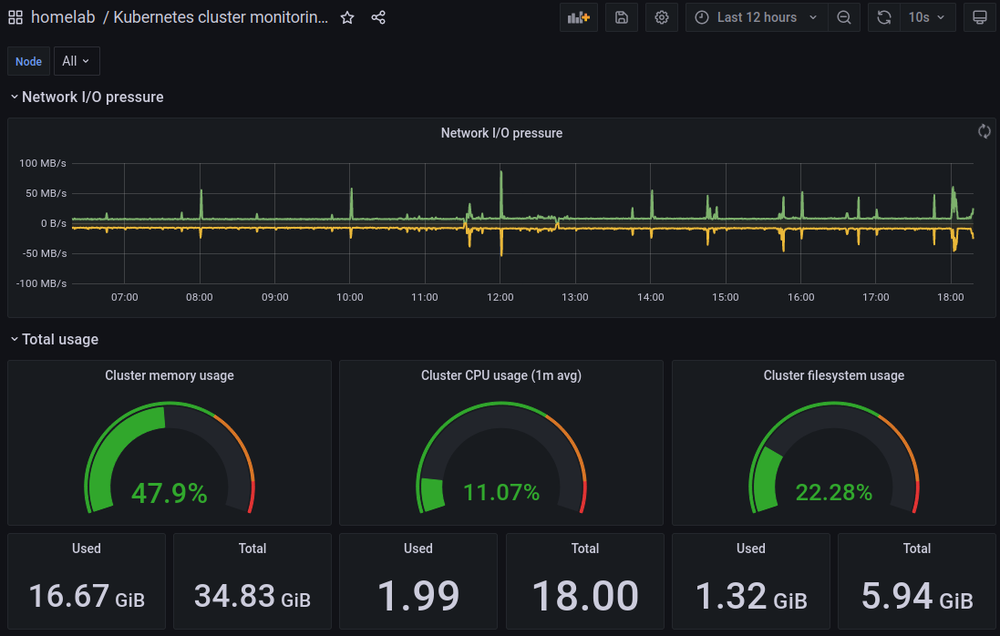

# Grafana

See https://grafana.com/oss/grafana/

Grafana allows you to query, visualise and alert on metrics that are stored in Prometheus (or somewhere else).

## Deploy Grafana

```
kubectl apply -f ./grafana
```

## Grafana Dashboards



