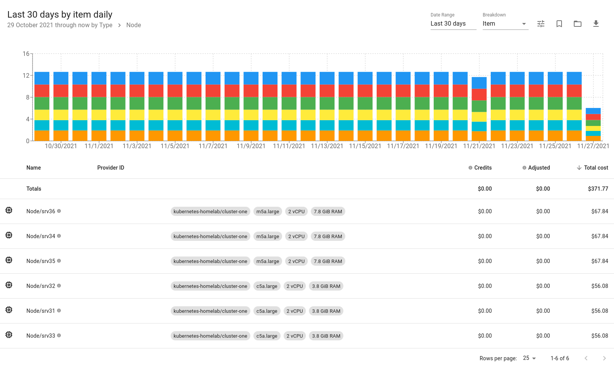

# Kubecost

See https://www.kubecost.com

Kubecost helps you monitor and manage cost and capacity in Kubernetes environments. 

## Install Kubecost Using Helm

### Pre-requisites

Add Helm repository:
```
helm repo add kubecost https://kubecost.github.io/cost-analyzer/
```

Create `kubecost` namespace:
```
kubectl create namespace kubecost
```

### Deploy Kubecost 

We are going to integrate Kubecost with our existing Prometheus.

We have to do several things:

* Set `prometheus.enabled` to `false`,
* Set `prometheus.nodeExporter.enabled` to `false`,
* Set `prometheus.fqdn` parameter to match our local Prometheus service address,
* Configure our Prometheus to scrape the cost-model `/metrics` endpoint,
* Add Prometheus recording rules to enable certain Kubecost features.

Note that we do not have to supply any value as a token, it does not seem to be validated, deployment works regardless.

```
helm upgrade --install kubecost \
  kubecost/cost-analyzer \
  --namespace kubecost \
  --set global.prometheus.enabled=false \
  --set global.prometheus.fqdn="http://prometheus-service.monitoring.svc:9090" \
  --set global.grafana.enabled=true \
  --set kubecostModel.imagePullPolicy="IfNotPresent" \
  --set kubecostModel.resources.requests.cpu="20m" \
  --set kubecostModel.resources.requests.memory="128Mi" \
  --set kubecostFrontend.imagePullPolicy="IfNotPresent" \
  --set networkCosts.enabled=false \
  --set networkCosts.imagePullPolicy="IfNotPresent" \
  --set persistentVolume.enabled=true \
  --set persistentVolume.size="10Gi" \
  --set persistentVolume.storageClass="freenas-nfs-csi" \
  --set prometheus.nodeExporter.enabled=false \
  --set prometheus.server.persistentVolume.enabled=false
```

Alternativelly, use a pre-configured `values.yaml` file:

```
helm upgrade --install kubecost \
  kubecost/cost-analyzer \
  --namespace kubecost \
  --version "1.91.2" \
  --values ./values.yaml
```

Create a `LoadBalancer` type service (this uses MetalLB) that will expose Kubecost to the network:
```
kubectl apply -f ./kubecost-service.yaml
```

Kubecost should be deployed:
```
$ kubectl get svc -n kubecost
NAME                          TYPE           CLUSTER-IP       EXTERNAL-IP   PORT(S)                      AGE
kubecost-cost-analyzer        ClusterIP      10.102.128.194   <none>        9001/TCP,9003/TCP,9090/TCP   42m
kubecost-grafana              ClusterIP      10.111.116.220   <none>        80/TCP                       42m
kubecost-kube-state-metrics   ClusterIP      10.106.178.102   <none>        8080/TCP                     42m
kubecost-service              LoadBalancer   10.102.54.33     10.11.1.52    80:31527/TCP                 9d
```

## Kubecost Reports

Monthly costs using AWS labels (if the homelab was hosted on AWS):


Assets and their total cost:


